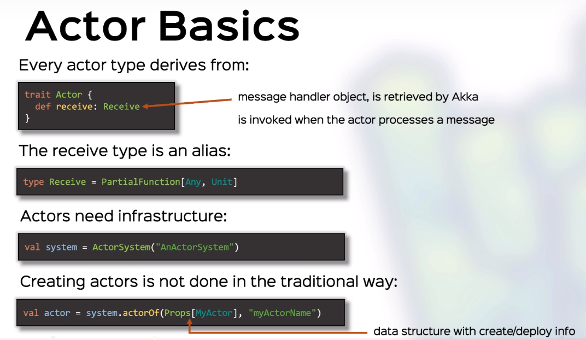
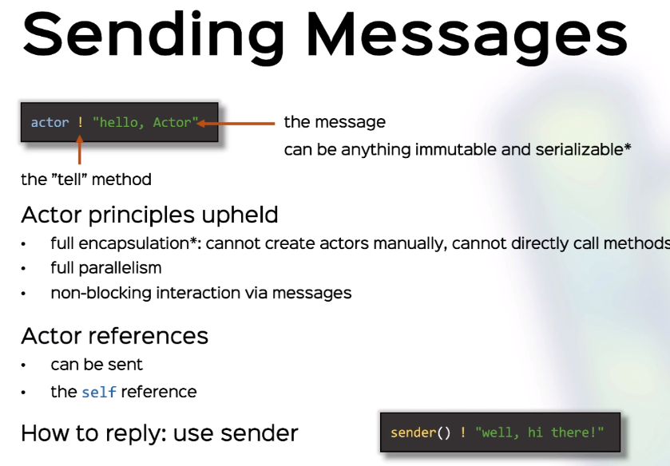
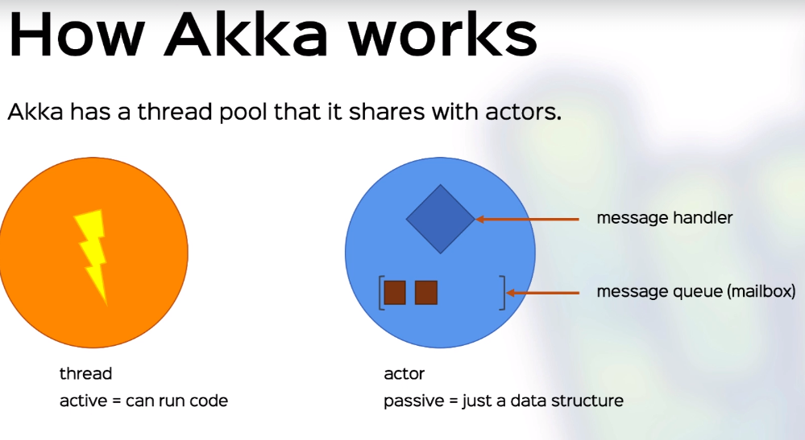
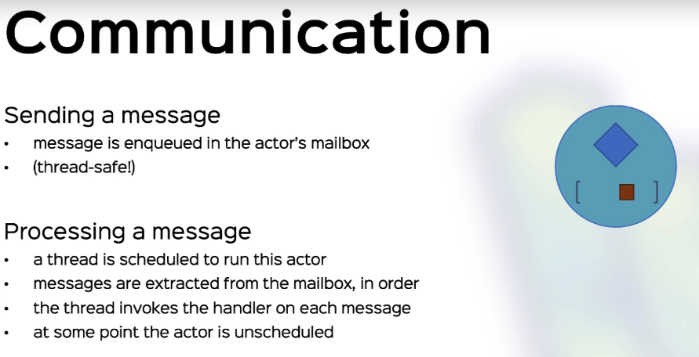
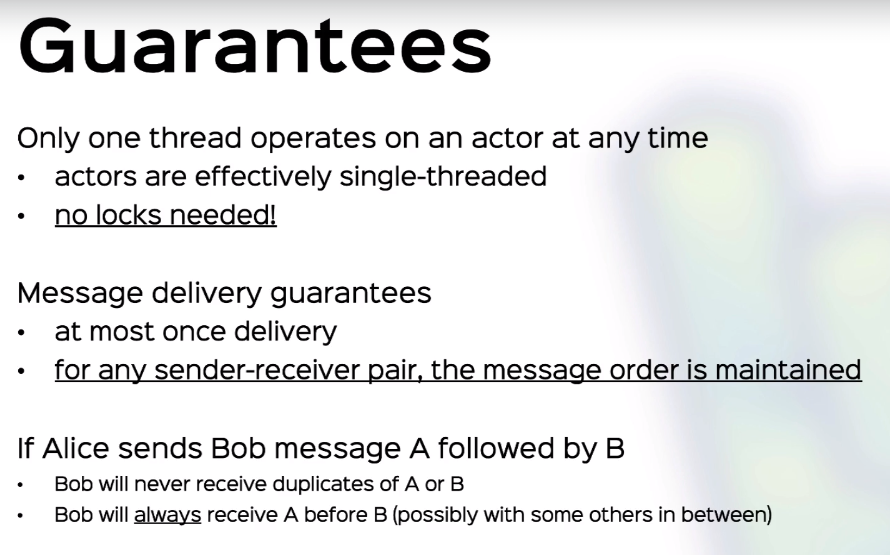

## Problem with Thread Model
OOP encapsulation is only valid in single threaded model.
> Can be solved by synchronization, but it creates another problems like deadlocks, livelocks.

> We need a data structure that is fully encapsulate in a multi threaded or distributed environment,
without use of locking.

- Tracing and dealing with errors in a multithreaded env. is pain
- Messaging or signaling between threads are error prone and hard

## Actors
With traditional objects:
- we store their state as data
- we call their methods

With Actors:
- we store their state as data
- we send messages to them, asynchronously

Actors are objects we cant access directly but only send messages.

## Actors Programming
First we create ActorSystem, this is like a pool of thread
<br>
Then we define actors in this system. 
- Actors are uniquely identified.
- Messages are asynchronous
- Each actor may respond differently
- Actors are encapsulated

### Message Types
Messages can be of any type
> but must be immutable and serializable. In practice we use case classes and case object





As a best practice when defining a behaviour in Actor, add this to the companion object.
<br>
For ex: if you define counter class it looks like this
```
object Counter {
    case object Increment
    case object Decrement
    case Object Print
}
class Counter extends Actor
```

## How Actor Works







## Changing Actor Behaviour
Think that a scenario where a kid has state happy or sad depending the interaction
with his mom.

We can do this by storing a var in kid actor. But it is mutable and typically we don't want.
Instead we define functions and call this functions based on the interaction.
<br>
This is where context helps us

```
  class StatelessFussyKid extends Actor {
    import FussyKid._
    import Mom._

    override def receive: Receive = happyReceive

    def happyReceive: Receive = {
      case Food(VEGETABLE) => context.become(sadReceive, false) // change my receive handler to sadReceive
      case Food(CHOCOLATE) =>
      case Ask(_) => sender() ! KidAccept
    }

    def sadReceive: Receive = {
      case Food(VEGETABLE) => context.become(sadReceive, false)
      case Food(CHOCOLATE) => context.unbecome()
      case Ask(_) => sender() ! KidReject
    }
  }
```

context.become(anotherHandler) => takes two param, default true
<br>
means that replaces current handler
<br>
context.become(anotherHandler, false) => add anotherHandler to the top of the stack
<br>
context.unbecome()  => reverting to the previous behavior => pops out from stack

> Rules: Akka always uses the latest handler on top of the stack. If the stack is empty, it calls receive

Why we use case object:
> we use case objects for case classes with no arguments - if we were to create a case class, then all the instances of that case class would be equal, so there's no point in creating multiple instances, so we might as well just use one (a case object).