Elements of an ER model
* Entity types
* Attributes
* Relationships
* Subtypes

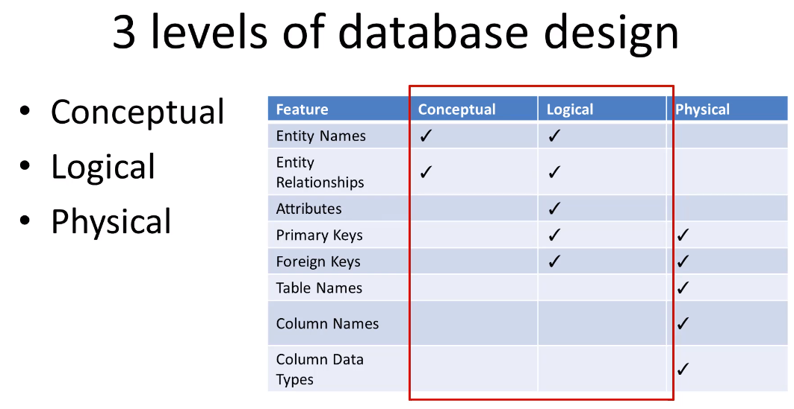

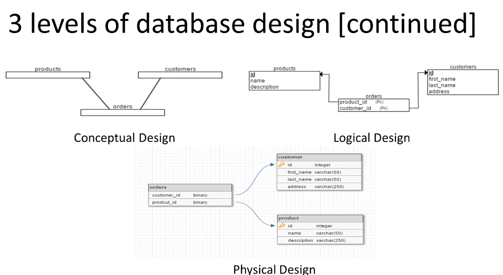

# ERD Symbols and Notations
## Entity
Entities, which are represented by rectangles. An entity is an object or concept about which you want to store information.
 
***Weak Entity***: It depends on a dominant entity, and it cannot exist without a strong entity. ex: A room in building
 
***Associative Entity***: An associative entity is the table that associates two other tables in a many to many relationship.

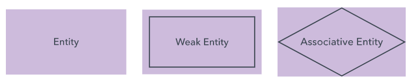

## Attribute
A property or characteristic of an entity. Often shown as an oval or circle.
 
***Simple Attributes*** : Single value, cannot be divided
***Composite Attributes*** : Can be divided into smaller parts. ex Address
***MultiValued Attributes*** : Have a set of values for each entity. ex PhoneNumbers
***Derived Attributes*** : Derived attributes are attributes that contain values calculated from other attributes. ex Age

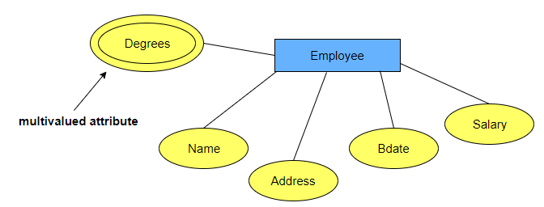
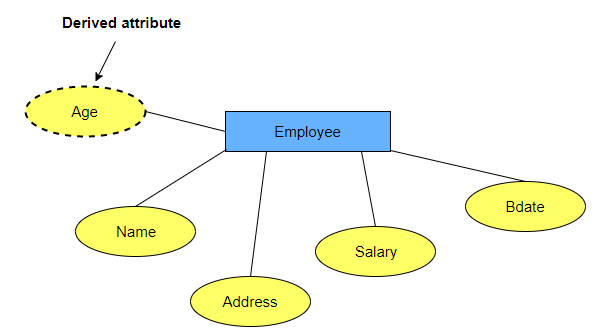

## Keys
Primary key and composite key.
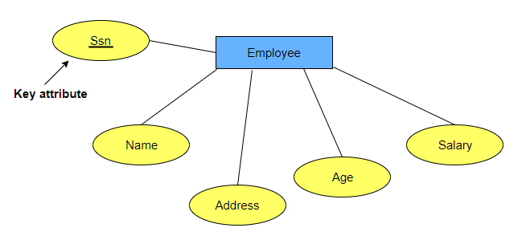
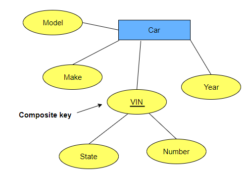

## Relationships
Chen style:

Crow's Foot
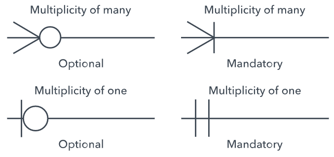

## Database Keys
***Super Key*** : A super key is defined as a set of attributes within a table that can uniquely identify each record within a table. Std_Id, (Std_Id, Name), Phone all can be super key.

***Candidate Key*** : 
Candidate keys are defined as the minimal set of fields that can uniquely identify each record in a table. There can be more than one candidate key. 
In our example, Std_Id and Phone both are candidate keys for the STUDENT table. The (Std_Id, Name) super key is not a candidate key as we can remove the Name field and still be able to uniquely identify each record

***Primary Key***: There can be more than one candidate key in a relation, out of which one can be chosen as the primary key. For Example, Std_Id as well as Phone both candidate keys for relation STUDENT but Std_Id can be chosen as the primary key (only one out of many candidate keys).

***Composite Key***: A key that consists of two or more attributes that uniquely identify any record in a table is called a composite key. But the attributes which together form the composite key are not a key independently or individually.

# Anomalies
Three types: insert, update delete 
Think that you have a table user and inside table you have address info. What happens when you apply crud
operations into some row. It needs to update all data where you change address info. This is called anomalies.
 
Use normalization to avoid anomalies.
 
To do normalization we must understand 2 things.
- Functional Dependencies 
- Normal forms

## Functional Dependency
Shows a relationship between attributes

# Normalization
Each normal form aims to further separate relationships into smaller instances as to create less redundancy and anomalies
 
0NF -> 1NF -> 2NF -> 3NF -> BCNF -> 4NF -> 5NF -> 6NF

## 0NF
Data is in 0 normal form when it is unnormalized.

## 1NF
Practically we use 3rd normal form.

- Each table cell should contains a single(atomic) value
- Each record needs to be unique

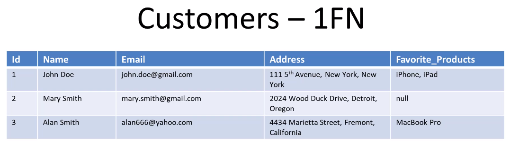

At the end
- Split columns to atomic values
- If multiple values can be assign to a record, move them to a new table

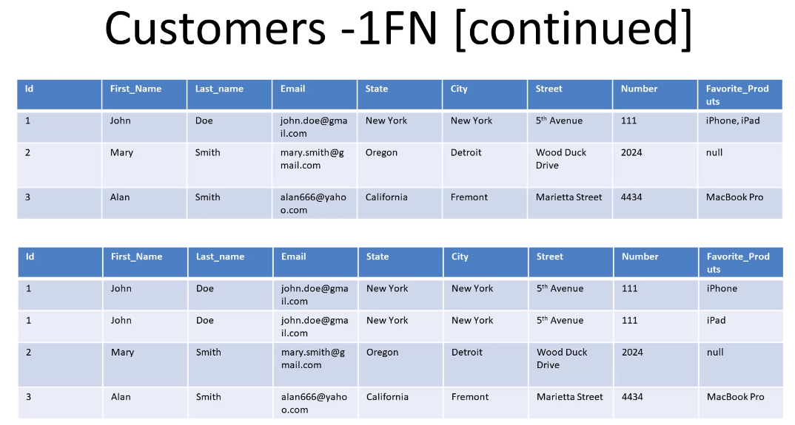

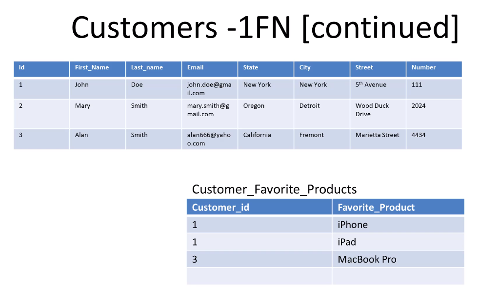

## 2NF
A table is in 2NF if it is in 1NF and every non-key attribute of the 
table is dependent on the whole(every attribute of the) composite primary key.
- Tables without composite primary key are in the 2NF by default

For ex: warranty belongs to product table, move it.
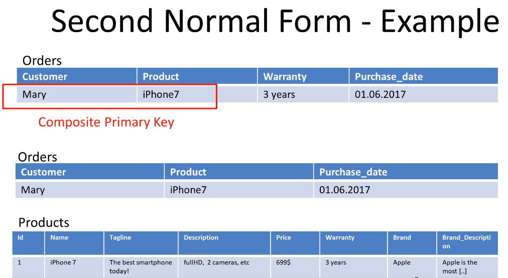

## 3NF
Applies every non-prime attribute of the table must be dependent on primary key, or
we can say that, there should not be the case that a non-prime attribute is 
determined by another non-prime attribute. So this transitive funtional
dependency should be removed from the table and also the table must be in 2NF

For ex: brand is more dependent on the brand than the product
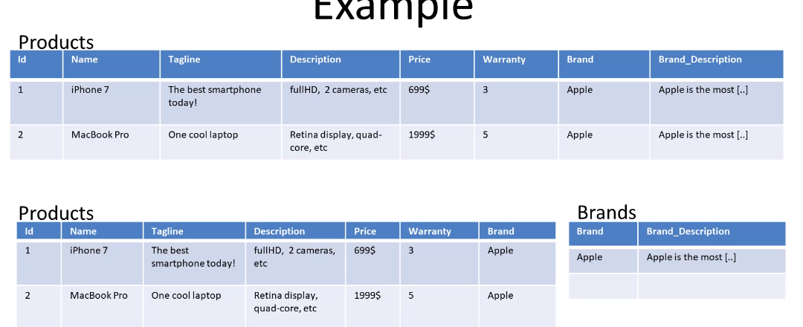

# Identifying Relationship vs Non-identifying Relationship
- Identifying -> Existence of a row in a child table depends on the parent table
For ex: a person has one or more phone numbers. So we need to keep it separate table.
 
In mysql it creates person id in phone numbers and phone id - person id together composite pk.

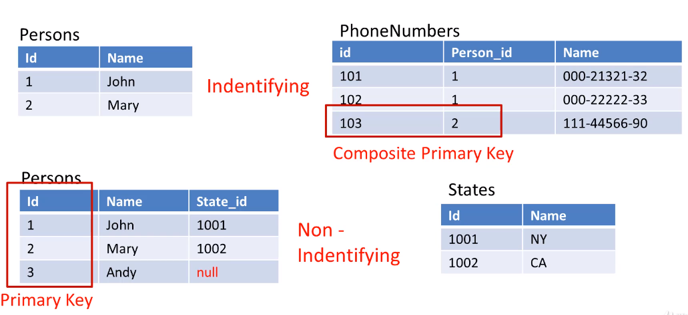
In practice we use non identifying by default.

# Cardinality
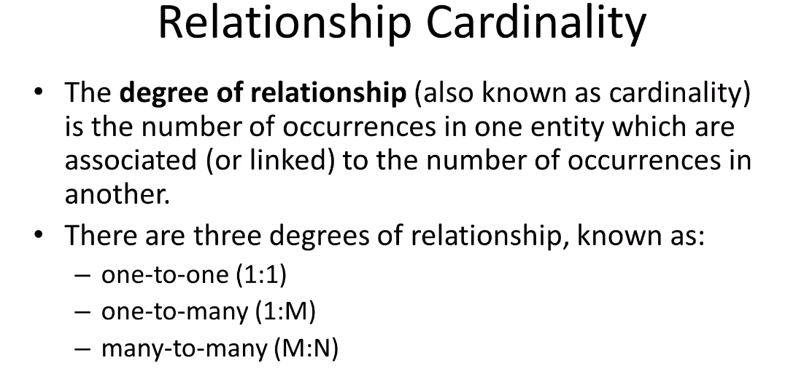