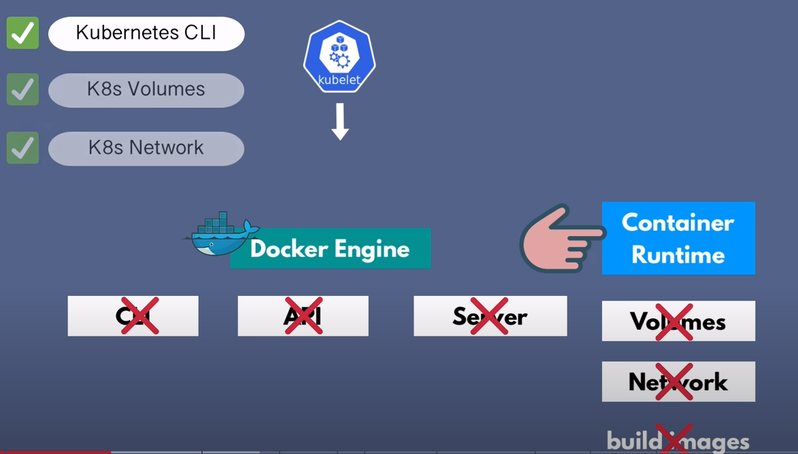
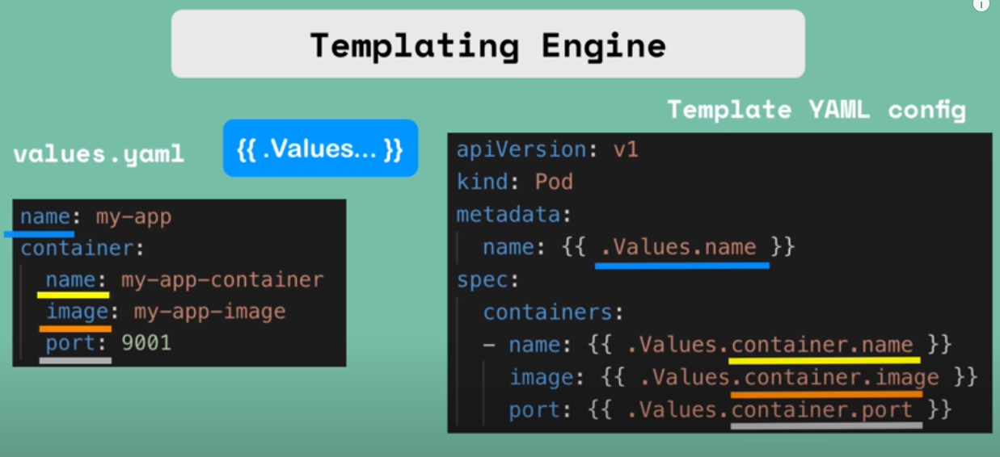
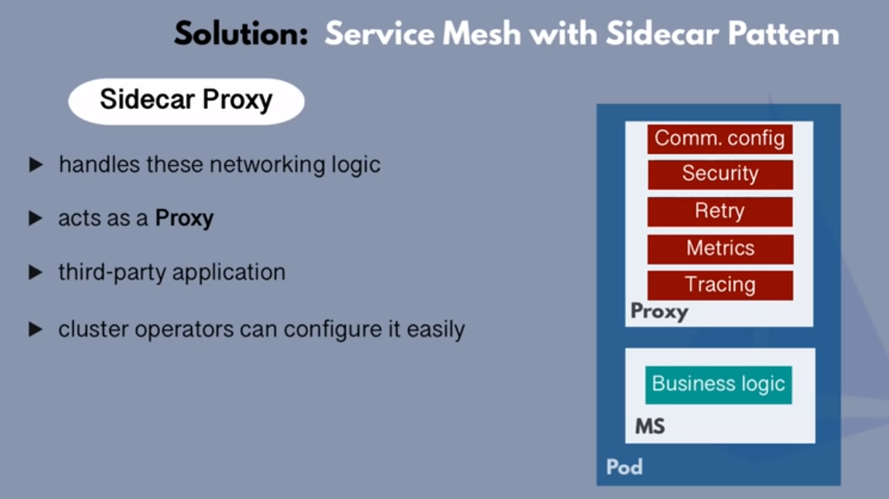
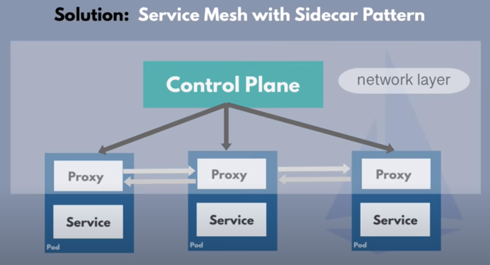
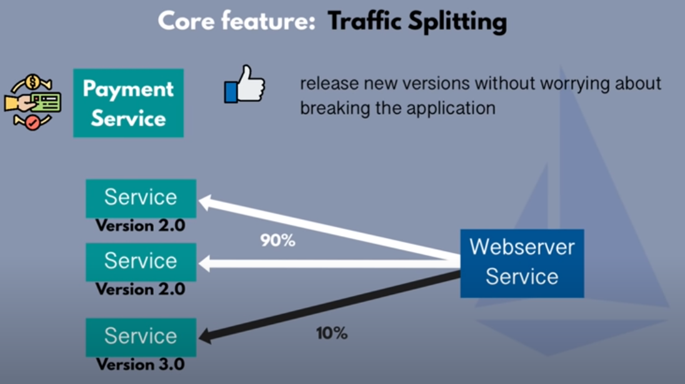
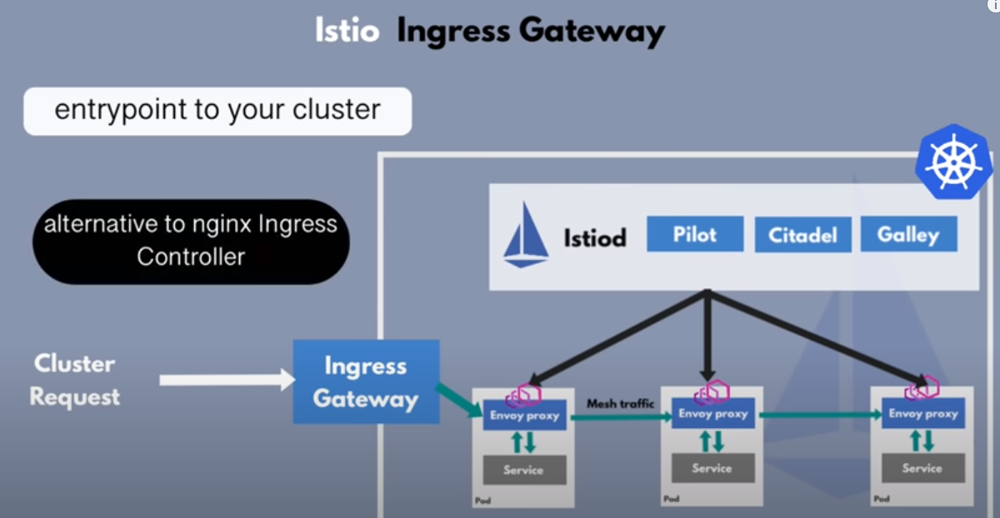

## Why Kubernetes Drops Docker Support
Container Runtime which is is renponsible for starting and stopping containers
basically managing the whole lifecycle

Kubernetes doesnt need some features provided from docker.

* less resource
* reduced security risk
Because less components mean less risk.

## Container Runtimes
containerd was a part of docker daemon but extracted as a separate component.
It is now part of CNCF.
 
Containerd already using in AWS EKS and GKE
 
Another alternative container runtime is cri-o which is used by Openshift.
 
This change doesnt affect to user which uses cloud solutions

So, Do the docker images are gonna work in Kubernetes?
> every docker image can run on any container runtime.
How is this possible?
> OCI (Open Container Initiative)
> it is a standard around container technology.
> Docker, containerd, cri-o comply to these standards.

## What is Helm?
package manager for kubernetes. Think it like yum, apt
* Package yaml files and distribute them.

Think about you just want to install elastic stack into your cluster.
 
You need to create objects like StateFulSet, ConfigMap, Secret, Services etc.
So a lot of work. What if someones create this files, package them and other people
can be able to use it just downloading. This is called helm charts.

> bundle of yaml files
> create your own helm charts with helk
> push them to helm repository
> download and use

The other advantages that helm provides us is templating engine.
In Kubernetes we mostly use same config for objects. We can define a common blueprint
and just refer this configs in files.

## Istio Service Mesh
Service mesh manages communication between microservices.

Why we need that? Because of the microservices arc. has some challenges.
> Application endpoints need to be somewhere
> Communication inside cluster is not secured, every service inside the cluster can talk to any other service
> Retry logic is also need
> Metrics and tracing is required

These non business logic must be added to each app. Developers focus shifted from business logic to 
non business logic. Also adds complexity to the services.

We dont have to add this sidecar configs. to microservice deployments yaml file.
 
Because service mesh has control plane that'll automatically inject proxy in every microservice pod's.
 
Now the microservices can talk to each other through those proxies.

One of the other usefull advantage that service mesh can provide us is traffic splitting.
This is known as canary deployment.

Service mesh is pattern, Istio is implementation.
> Istio uses envoy proxy which is independent oss. 
> Controle plane component is istiod which manages and injects proxies.

### How to configure Istio?
It is configured with Kubernetes YAML files.
Istio uses Kubernetes CustomResourceDefinitions(CRD).
<cr>
It's a custom Kubernetes component for 3rd party apps like prometheus, istio etc.

### Istio features
> Dynamic service discovery: no static endpoints live, new microservices gets registered automatically.
> Istio is also provides certificate management for ms.
> metrics and tracing gathers from proxies.

### Istio Ingress Gateway
Alternative to nginx ingress.

## StatefulSet
Stateful applications are like databases.
We use Deployment object in Kubernetes to deploy stateless apps.
 
We use statefulset object for deploy stateful apps.
 
