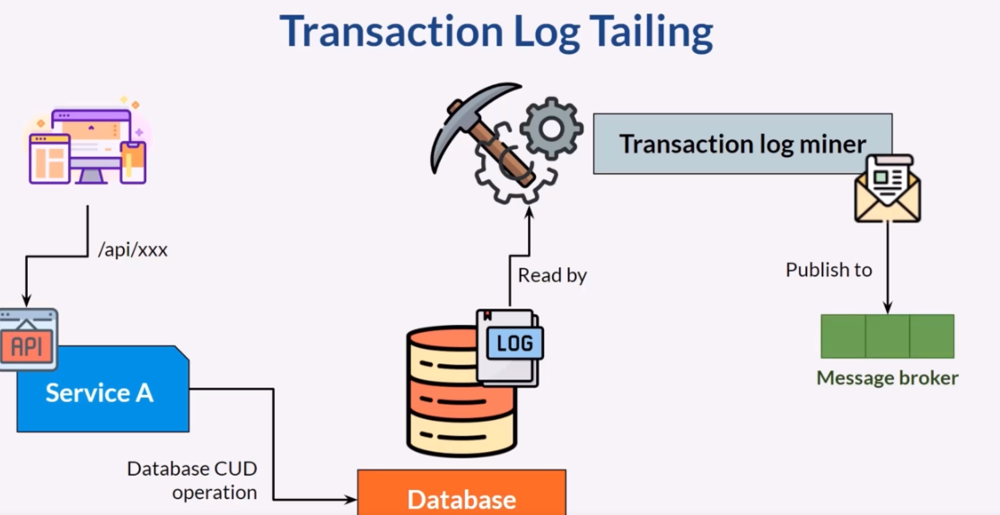
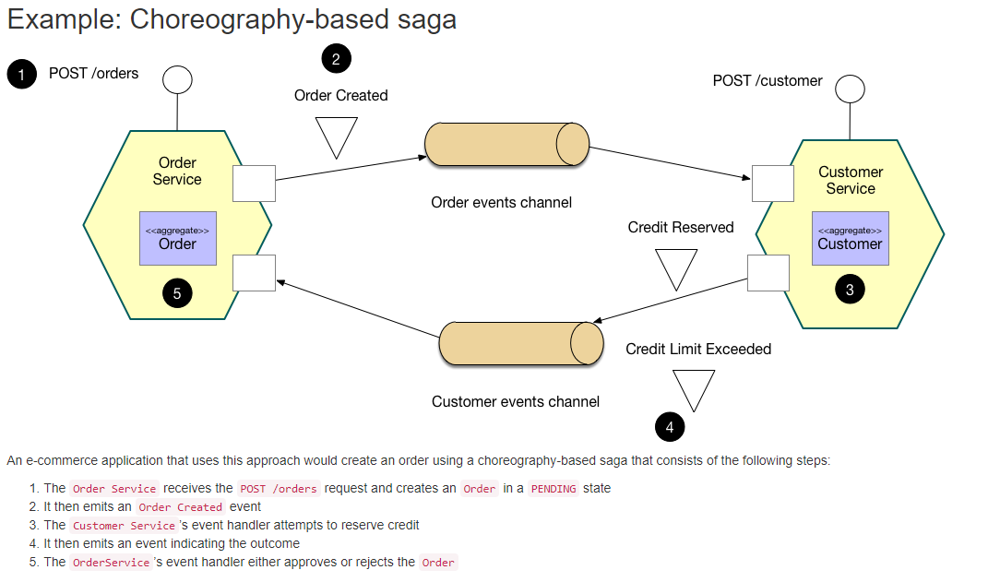
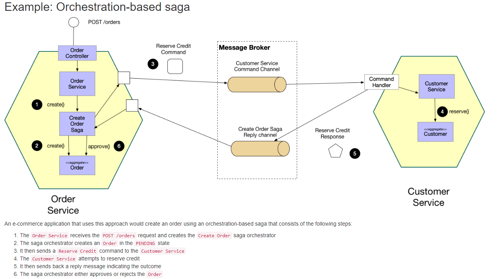
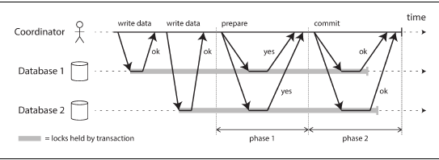
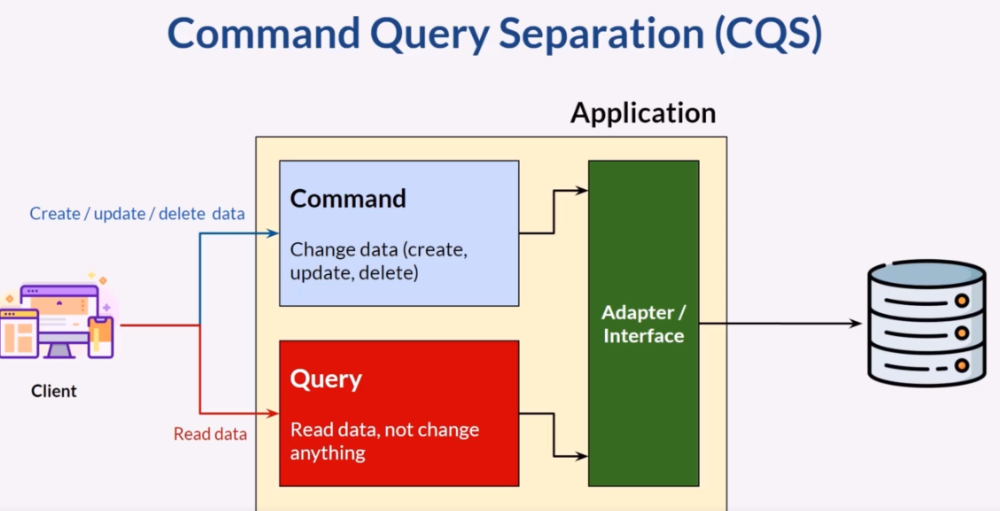
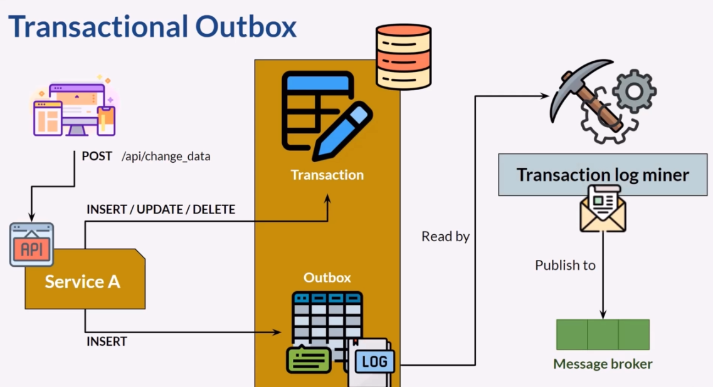
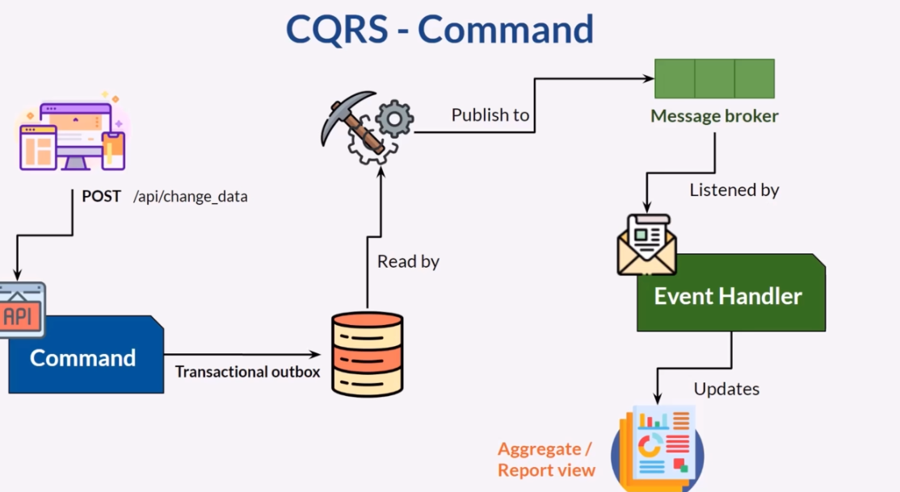

# MICROSERVICES
## Change Data Capture
Identify the changes on the data. Database operation and message publishing must be in a transaction.
The problem with that approach is that some of the components may not be available.
In this case we had issues with consistency. the solution is Transaction Log Tailing.
 
The architecture works like this.

The most known solution transaction log miner is debezium.

## SAGA
You have applied the Database per Service pattern. Each service has its own database. Some business transactions, however, span multiple service so you need a mechanism to implement transactions that span services. For example, let’s imagine that you are building an e-commerce store where customers have a credit limit. The application must ensure that a new order will not exceed the customer’s credit limit. Since Orders and Customers are in different databases owned by different services the application cannot simply use a local ACID transaction.

> What is a Transaction?
* A transaction is a way for an application to group several reads and writes
together into a logical unit. Conceptually, all the reads and writes in a transaction are
executed as one operation: either the entire transaction succeeds (commit) or it fails
(abort, rollback).

 
To be able to manage the transaction between services we can call a series of API.
 

> The advantage of this approach is: 
* Straightforward
* Easy to implement

> The problem with that approach;
* All nodes must be available
* We can not rollback
* Lots of API calls create latency problems
* Sync communication, blocking API

SAGA, async, non-blocking communication via message broker
Saga is a sequence of local transactions. Each local transactions updates their own data
and then publish and event to a message broker.
 
There are two ways of coordination sagas:

* Choreography - each local transaction publishes domain events that trigger local transactions in other services
* Orchestration - an orchestrator (object) tells the participants what local transactions to execute

> PROS
* Consistent data
* Loosely coupled
* Happy customer due the fast processing
* It enables an application to maintain data consistency across multiple services without using distributed transactions
> CONS
* Harder implementation
> Things to consider
* In order to be reliable, a service must atomically update its database and publish a message/event. It cannot use the traditional mechanism of a distributed transaction that spans the database and the message broker. Instead, it must use one of the patterns listed below.

Choreography, simpler implementation, cyclic dependencies.
Orchestration, too many business logic on orchestrator.

Advantage of Saga:
> One big advantage of the Saga pattern is its support for long-lived transactions. Because each microservice focuses only on its own local atomic transaction, other microservices are not blocked if a microservice is running for a long time. This also allows transactions to continue waiting for user input. Also, because all local transactions are happening in parallel, there is no lock on any object.

Disadvantage:
> The Saga pattern is difficult to debug, especially when many microservices are involved. Also, the event messages could become difficult to maintain if the system gets complex. Another disadvantage of the Saga pattern is it does not have read isolation. For example, the customer could see the order being created, but in the next second, the order is removed due to a compensation transaction.

## Two Phase Commit

Two-phase commit is an algorithm for achieving atomic transaction commit across
multiple nodes—i.e., to ensure that either all nodes commit or all nodes abort. It is a
classic algorithm in distributed databases.
 
There is a coordinator and participants in this architecture.
 
A 2PC transaction begins with the application reading and writing data on multiple
database nodes, as normal. We call these database nodes participants in the transaction.
When the application is ready to commit, the coordinator begins phase 1: it
sends a prepare request to each of the nodes, asking them whether they are able to
commit. The coordinator then tracks the responses from the participants

> If all participants reply “yes,” indicating they are ready to commit, then the coordinator
sends out a commit request in phase 2, and the commit actually takes
place. 
> If any of the participants replies “no,” the coordinator sends an abort request to
all nodes in phase 2.

Benefits:
> 2pc is a very strong consistency protocol. First, the prepare and commit phases guarantee that the transaction is atomic. The transaction will end with either all microservices returning successfully or all microservices have nothing changed.  Secondly, 2pc allows read-write isolation. This means the changes on a field are not visible until the coordinator commits the changes.

Disadvantages:
> While 2pc has solved the problem, it is not really recommended for many microservice-based systems because 2pc is synchronous (blocking). The protocol will need to lock the object that will be changed before the transaction completes. In the example above, if a customer places an order, the “fund” field will be locked for the customer. This prevents the customer from applying new orders. This makes sense because if a “prepared” object changed after it claims it is “prepared,” then the commit phase could possibly not work.

> This is not good. In a database system, transactions tend to be fast—normally within 50 ms. However, microservices have long delays with RPC calls, especially when integrating with external services such as a payment service. The lock could become a system performance bottleneck. Also, it is possible to have two transactions mutually lock each other (deadlock) when each transaction requests a lock on a resource the other requires.

SAGA , ACD dedir. Buradaki isolation olayını bi arastır.

## CQRS
You have applied the Microservices architecture pattern and the Database per service pattern. As a result, it is no longer straightforward to implement queries that join data from multiple services. Also, if you have applied the Event sourcing pattern then the data is no longer easily queried.
 

> Problem: How to implement a query that retrieves data from multiple services in a microservice architecture?
> Solution: Define a view database, which is a read-only replica that is designed to support that query. The application keeps the replica up to data by subscribing to Domain events published by the service that own the data.

In microservices architecture we typically have one db per service.
If database is common for services then querying data is simple. 
> Drawbacks are single POF, coupleness issues

Other solution migth be API Composition. In this pattern we have an API Composer layer
which pull data from microservices, combine data and exposes and interface to the client.

> Simple, not depends on the db product
> Drawbacks are, the owenership of the layer is unknown. Might be slow. If one of the microservices
has failed its a problem. Data inconsistency is possible.

Other alternative is CQRS.
 
This approach rely on change data event. For ex: every data change will send event to payment 
history service to update payment history data. Payment history service can expose this data
through an API.

> Faster and simplier 
> Unlike API composition, data changes process async and the system more available.

> Drawbacks -> increased complexity, data inconsistency.

## CQS

* In CQS commmand and query method can be in the same object/class but seperated in CQRS.
Key principle looks same.

# Pattern: Transactional outbox
A service command typically needs to update the database and send messages/events. For example, a service that participates in a saga needs to atomically update the database and sends messages/events. Similarly, a service that publishes a domain event must atomically update an aggregate and publish an event. The database update and sending of the message must be atomic in order to avoid data inconsistencies and bugs. However, it is not viable to use a distributed transaction that spans the database and the message broker to atomically update the database and publish messages/events.
 

> Problem: How to reliably/atomically update the database and publish messages/events?
> Solution: A service that uses a relational database inserts messages/events into an outbox table (e.g. MESSAGE) as part of the local transaction. An service that uses a NoSQL database appends the messages/events to attribute of the record (e.g. document or item) being updated. A separate Message Relay process publishes the events inserted into database to a message broker.
Remember debezium for this approach.

Client calls a service to insert, Service will insert this data into Transaction table.
Then it insert data to an outbox table. Transaction log miner reads data from outbox table
and publish this event to a message broker.
 
So this way we solve transaction problem. Than an event handler listens this broker
will update the aggreate/view

> In CQRS, entity that represents report view table commonly known as aggregate

> Report view/Aggreate, can be in the same db with another schema or in another db.
> This data is not relational so ElastichSearch or Mongo makes sense for better performance.

> Advantages
* Supports multiple denormalized views that are scalable and performant
* Improved separation of concerns = simpler command and query models
* Necessary in an event sourced architecture
> Drawbacks
* Increased complexity
* Potential code duplication
* Replication lag/eventually consistent views

## Pattern: Transaction log tailing
You have applied the Transactional Outbox pattern.
> How to publish messages/events into the outbox in the database to the message broker?
> Solution: Tail the database transaction log and publish each message/event inserted into the outbox to the message broker.
Produts that helps:
* Debezium
* MySQL binlog
* Postgres WAL
* AWS DynamoDB table streams

## Event Sourcing
Event Sourcing ensures that all changes to application state are stored as a sequence of events. Not just can we query these events, we can also use the event log to reconstruct past states.

> Sequence is important because in the wrong order we can calculate something wrong.
An example of event is bank account transactions.
> Happened in the past, cannot be changed and cannot be deleted.

> Event sourcing helps us build fault tolerant application. We can reconstruct the application
if any fault happen.

* AXON is a framework for event sourcing and CQRS

## API GW 
Known as also API Composition. It can be replacement for CQRS.
CQRS is harder to implement, this patterns so much simple.