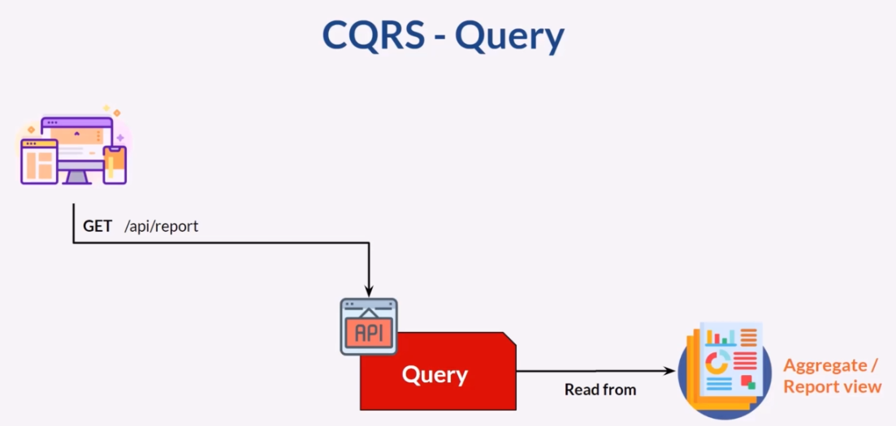

# MICROSERVICES

## Advantages
- Easier to understand and develop
- Less jar hell
- Faster to build and deploy
- Reduced startup time
- Scales development: develop, deploy and scale each service independently
- Eliminate long term commitment to a single technology stack.

## Drawbacks
- Developing and deploying features that span multiple services requires careful coordination

## When to use?
In the beginning, you don't need it, it will slow you down.

## Partitioning Strategies
- By noun, e.g. catalog service
- by verb, e.g. checkout ui
- by subdomain
- single respon. princip

# Deployment Patterns
- Building and deploying a service must be fast
- SErvices must be deployed and scaled independently
- Service instances need to be isolated
- Deployments must be reliable

## Multiple Services Per Host
Benefits
- Efficient resource utilization 
- Fast deployment
Drawbacks
- Poor isolation
- Difficult to limit resource utilization
- Poor encapsulation

## Change Data Capture
Identify the changes on the data. Database operation and message publishing must be in a transaction.
The problem with that approach is that some of the components may not be available.
In this case we had issues with consistency. the solution is Transaction Log Tailing.
 
The architecture works like this.

The most known solution transaction log miner is debezium.

## SAGA
You have applied the Database per Service pattern. Each service has its own database. Some business transactions, however, span multiple service so you need a mechanism to implement transactions that span services. For example, let’s imagine that you are building an e-commerce store where customers have a credit limit. The application must ensure that a new order will not exceed the customer’s credit limit. Since Orders and Customers are in different databases owned by different services the application cannot simply use a local ACID transaction.

> What is a Transaction?
* A transaction is a way for an application to group several reads and writes
together into a logical unit. Conceptually, all the reads and writes in a transaction are
executed as one operation: either the entire transaction succeeds (commit) or it fails
(abort, rollback).

 
To be able to manage the transaction between services we can call a series of API.
 

> The advantage of this approach is: 
* Straightforward
* Easy to implement

> The problem with that approach;
* All nodes must be available
* We can not rollback
* Lots of API calls create latency problems
* Sync communication, blocking API

SAGA, async, non-blocking communication via message broker
Saga is a sequence of local transactions. Each local transactions updates their own data
and then publish and event to a message broker.
 
There are two ways of coordination sagas:

* Choreography - each local transaction publishes domain events that trigger local transactions in other services
* Orchestration - an orchestrator (object) tells the participants what local transactions to execute

> PROS
* Consistent data
* Loosely coupled
* Happy customer due the fast processing
* It enables an application to maintain data consistency across multiple services without using distributed transactions
> CONS
* Harder implementation
> Things to consider
* In order to be reliable, a service must atomically update its database and publish a message/event. It cannot use the traditional mechanism of a distributed transaction that spans the database and the message broker. Instead, it must use one of the patterns listed below.

Choreography, simpler implementation, cyclic dependencies.
Orchestration, too many business logic on orchestrator.

Advantage of Saga:
> One big advantage of the Saga pattern is its support for long-lived transactions. Because each microservice focuses only on its own local atomic transaction, other microservices are not blocked if a microservice is running for a long time. This also allows transactions to continue waiting for user input. Also, because all local transactions are happening in parallel, there is no lock on any object.

Disadvantage:
> The Saga pattern is difficult to debug, especially when many microservices are involved. Also, the event messages could become difficult to maintain if the system gets complex. Another disadvantage of the Saga pattern is it does not have read isolation. For example, the customer could see the order being created, but in the next second, the order is removed due to a compensation transaction.

## Two Phase Commit

Two-phase commit is an algorithm for achieving atomic transaction commit across
multiple nodes—i.e., to ensure that either all nodes commit or all nodes abort. It is a
classic algorithm in distributed databases.
 
There is a coordinator and participants in this architecture.
 
A 2PC transaction begins with the application reading and writing data on multiple
database nodes, as normal. We call these database nodes participants in the transaction.
When the application is ready to commit, the coordinator begins phase 1: it
sends a prepare request to each of the nodes, asking them whether they are able to
commit. The coordinator then tracks the responses from the participants

> If all participants reply “yes,” indicating they are ready to commit, then the coordinator
sends out a commit request in phase 2, and the commit actually takes
place. 
> If any of the participants replies “no,” the coordinator sends an abort request to
all nodes in phase 2.

Benefits:
> 2pc is a very strong consistency protocol. First, the prepare and commit phases guarantee that the transaction is atomic. The transaction will end with either all microservices returning successfully or all microservices have nothing changed.  Secondly, 2pc allows read-write isolation. This means the changes on a field are not visible until the coordinator commits the changes.

Disadvantages:
> While 2pc has solved the problem, it is not really recommended for many microservice-based systems because 2pc is synchronous (blocking). The protocol will need to lock the object that will be changed before the transaction completes. In the example above, if a customer places an order, the “fund” field will be locked for the customer. This prevents the customer from applying new orders. This makes sense because if a “prepared” object changed after it claims it is “prepared,” then the commit phase could possibly not work.

> This is not good. In a database system, transactions tend to be fast—normally within 50 ms. However, microservices have long delays with RPC calls, especially when integrating with external services such as a payment service. The lock could become a system performance bottleneck. Also, it is possible to have two transactions mutually lock each other (deadlock) when each transaction requests a lock on a resource the other requires.

SAGA , ACD dedir. Buradaki isolation olayını bi arastır.

## CQRS
You have applied the Microservices architecture pattern and the Database per service pattern. As a result, it is no longer straightforward to implement queries that join data from multiple services. Also, if you have applied the Event sourcing pattern then the data is no longer easily queried.
 

> Problem: How to implement a query that retrieves data from multiple services in a microservice architecture?
> Solution: Define a view database, which is a read-only replica that is designed to support that query. The application keeps the replica up to data by subscribing to Domain events published by the service that own the data.

In microservices architecture we typically have one db per service.
If database is common for services then querying data is simple. 
> Drawbacks are single POF, coupleness issues

Other solution migth be API Composition. In this pattern we have an API Composer layer
which pull data from microservices, combine data and exposes and interface to the client.

> Simple, not depends on the db product
> Drawbacks are, the owenership of the layer is unknown. Might be slow. If one of the microservices
has failed its a problem. Data inconsistency is possible.

Other alternative is CQRS.
 
This approach rely on change data event. For ex: every data change will send event to payment 
history service to update payment history data. Payment history service can expose this data
through an API.

> Faster and simplier 
> Unlike API composition, data changes process async and the system more available.

> Drawbacks -> increased complexity, data inconsistency.

## CQS

* In CQS commmand and query method can be in the same object/class but seperated in CQRS.
Key principle looks same.

# Pattern: Transactional outbox
A service command typically needs to update the database and send messages/events. For example, a service that participates in a saga needs to atomically update the database and sends messages/events. Similarly, a service that publishes a domain event must atomically update an aggregate and publish an event. The database update and sending of the message must be atomic in order to avoid data inconsistencies and bugs. However, it is not viable to use a distributed transaction that spans the database and the message broker to atomically update the database and publish messages/events.
 

> Problem: How to reliably/atomically update the database and publish messages/events?
> Solution: A service that uses a relational database inserts messages/events into an outbox table (e.g. MESSAGE) as part of the local transaction. An service that uses a NoSQL database appends the messages/events to attribute of the record (e.g. document or item) being updated. A separate Message Relay process publishes the events inserted into database to a message broker.
Remember debezium for this approach.

Client calls a service to insert, Service will insert this data into Transaction table.
Then it insert data to an outbox table. Transaction log miner reads data from outbox table
and publish this event to a message broker.
 
So this way we solve transaction problem. Than an event handler listens this broker
will update the aggreate/view

> In CQRS, entity that represents report view table commonly known as aggregate

> Report view/Aggreate, can be in the same db with another schema or in another db.
> This data is not relational so ElastichSearch or Mongo makes sense for better performance.

> Advantages
* Supports multiple denormalized views that are scalable and performant
* Improved separation of concerns = simpler command and query models
* Necessary in an event sourced architecture
> Drawbacks
* Increased complexity
* Potential code duplication
* Replication lag/eventually consistent views

## Pattern: Transaction log tailing
You have applied the Transactional Outbox pattern.
> How to publish messages/events into the outbox in the database to the message broker?
> Solution: Tail the database transaction log and publish each message/event inserted into the outbox to the message broker.
Produts that helps:
* Debezium
* MySQL binlog
* Postgres WAL
* AWS DynamoDB table streams

## Event Sourcing
Event Sourcing ensures that all changes to application state are stored as a sequence of events. Not just can we query these events, we can also use the event log to reconstruct past states.

> Sequence is important because in the wrong order we can calculate something wrong.
An example of event is bank account transactions.
> Happened in the past, cannot be changed and cannot be deleted.

> Event sourcing helps us build fault tolerant application. We can reconstruct the application
if any fault happen.

* AXON is a framework for event sourcing and CQRS

## API GW 
Known as also API Composition. It can be replacement for CQRS.
CQRS is harder to implement, this patterns so much simple.

## SAGA
### The trouble with distributed transactions
The traditional approach to maintaining data consistency across multiple services,
databases, or message brokers is to use distributed transactions. The de facto standard
for distributed transaction management is the X/Open Distributed Transaction Processing
(DTP) Model (X/Open XA—see https://en.wikipedia.org/wiki/X/Open_XA).
XA uses two-phase commit (2PC) to ensure that all participants in a transaction either
commit or rollback. An XA-compliant technology stack consists of XA-compliant databases
and message brokers, database drivers, and messaging APIs, and an interprocess
communication mechanism that propagates the XA global transaction ID. Most SQL
databases are XA compliant, as are some message brokers. Java EE applications can,
for example, use JTA to perform distributed transactions.

* Popular nosql databases and message brokers doesn't support distributed transaction (Mongo, cassandra, rabbitmq, kafka)
* Another problem with distributed transactions is that they are a form of synchronous
IPC, which reduces availability.
* In order for a distributed transaction to commit,
all the participating services must be available. As described in chapter 3, the availability
is the product of the availability of all of the participants in the transaction.
* Each additional service involved in a distributed
transaction further reduces availability.

* There is even Eric Brewer’s CAP theorem,
which states that a system can only have two of the following three properties:
Consumer Ticket Account
Data consistency required
Writes Writes
createOrder()
Reads
Kitchen Service Accounting Service
Order
Order Service
Consumer Service
The createOrder() operation reads from
Consumer Service and updates data
in Order Service, Kitchen Service,
and Accounting Service. Order
controller
Figure 4.1 The createOrder() operation updates data in several services. It must use a
mechanism to maintain data consistency across those services.
114 CHAPTER 4 Managing transactions with sagas
consistency, availability, and partition tolerance (https://en.wikipedia.org/wiki/CAP
_theorem). Today, architects prefer to have a system that’s available rather than one
that’s consistent.

To solve the more complex problem
of maintaining data consistency in a microservice architecture, an application
must use a different mechanism that builds on the concept of loosely coupled, asynchronous
services. This is where sagas come in.

* Sagas differ from ACID transactions in a couple of important ways. As I describe in
detail in section 4.3, they lack the isolation property of ACID transactions. Also, because
each local transaction commits its changes, a saga must be rolled back using compensating
transactions.

* Not only does
using messaging ensure the saga participants are loosely coupled, it also guarantees
that a saga completes. That’s because if the recipient of a message is temporarily
unavailable, the message broker buffers the message until it can be delivered.

### Compensating Transactions
A great feature of traditional ACID transactions is that the business logic can easily
roll back a transaction if it detects the violation of a business rule. It executes a ROLLBACK
statement, and the database undoes all the changes made so far. Unfortunately,
sagas can’t be automatically rolled back, because each step commits its changes to the
local database. This means, for example, that if the authorization of the credit card
fails in the fourth step of the Create Order Saga, the FTGO application must explicitly
undo the changes made by the first three steps. You must write what are known as compensating
transactions.

* It’s important to
note that not all steps need compensating transactions. Read-only steps, such as verify-
ConsumerDetails(), don’t need compensating transactions.

### Reliable event based communication
* It’s essential that the database update and the publishing of the event happen atomically.
* The second issue you need to consider is ensuring that a saga participant must
be able to map each event that it receives to its own data.
* The solution is for a saga participant to publish events containing
a **correlation id**, which is data that enables other participants to perform the
mapping.

For example, the participants of the Create Order Saga can use the orderId as a
correlation ID that’s passed from one participant to the next. Accounting Service publishes
a Credit Card Authorized event containing the orderId from the Ticket-
Created event. When Order Service receives a Credit Card Authorized event, it uses
the orderId to retrieve the corresponding Order. Similarly, Kitchen Service uses the
orderId from that event to retrieve the corresponding Ticket.

### BENEFITS AND DRAWBACKS OF CHOREOGRAPHY-BASED SAGAS
* ***Simplicity***—Services publish events when they create, update, or delete business
objects.
* ***Loose coupling*** —The participants subscribe to events and don’t have direct knowledge
of each other.

And there are some drawbacks:
* More difficult to understand—Unlike with orchestration, there isn’t a single place
in the code that defines the saga. Instead, choreography distributes the implementation
of the saga among the services. Consequently, it’s sometimes difficult
for a developer to understand how a given saga works.

* Cyclic dependencies between the services—The saga participants subscribe to each
other’s events, which often creates cyclic dependencies. For example, if you
carefully examine figure 4.4, you’ll see that there are cyclic dependencies, such
as Order Service  Accounting Service  Order Service. Although this isn’t
necessarily a problem, cyclic dependencies are considered a design smell.

* Risk of tight coupling—Each saga participant needs to subscribe to all events that
affect them. For example, Accounting Service must subscribe to all events that
cause the consumer’s credit card to be charged or refunded. As a result, there’s
a risk that it would need to be updated in lockstep with the order lifecycle
implemented by Order Service.

Choreography can work well for simple sagas, but because of these drawbacks it’s
often better for more complex sagas to use orchestration. Let’s look at how orchestration
works.

### BENEFITS AND DRAWBACKS OF ORCHESTRATION-BASED SAGAS
* ***Simpler dependencies***—One benefit of orchestration is that it doesn’t introduce
cyclic dependencies. The saga orchestrator invokes the saga participants, but
the participants don’t invoke the orchestrator. As a result, the orchestrator
depends on the participants but not vice versa, and so there are no cyclic
dependencies.

* ***Less coupling***—Each service implements an API that is invoked by the orchestrator,
so it does not need to know about the events published by the saga
participants.

* ***Improves separation of concerns and simplifies the business logic***—The saga coordination
logic is localized in the saga orchestrator. The domain objects are simpler
and have no knowledge of the sagas that they participate in. For example, when
using orchestration, the Order class has no knowledge of any of the sagas, so it
has a simpler state machine model. During the execution of the Create Order
Saga, it transitions directly from the APPROVAL_PENDING state to the APPROVED
state. The Order class doesn’t have any intermediate states corresponding to the
steps of the saga. As a result, the business is much simpler.

Orchestration also has a drawback: the risk of centralizing too much business logic in
the orchestrator. This results in a design where the smart orchestrator tells the dumb
services what operations to do. Fortunately, you can avoid this problem by designing
orchestrators that are solely responsible for sequencing and don’t contain any other
business logic.

I recommend using orchestration for all but the simplest sagas. Implementing the
coordination logic for your sagas is just one of the design problems you need to solve.
Another, which is perhaps the biggest challenge that you’ll face when using sagas, is
handling the lack of isolation. Let’s take a look at that problem and how to solve it.

### Handling the lack of Isolation
The I in ACID stands for isolation. The isolation property of ACID transactions ensures
that the outcome of executing multiple transactions concurrently is the same as if they
were executed in some serial order. The database provides the illusion that each ACID
transaction has exclusive access to the data. Isolation makes it a lot easier to write business
logic that executes concurrently.

The challenge with using sagas is that they lack the isolation property of ACID
transactions. That’s because the updates made by each of a saga’s local transactions
are immediately visible to other sagas once that transaction commits. This behavior
can cause two problems. First, other sagas can change the data accessed by the saga
while it’s executing. And other sagas can read its data before the saga has completed
its updates, and consequently can be exposed to inconsistent data. You can, in fact,
consider a saga to be ACD:

* ***Atomicity***—The saga implementation ensures that all transactions are executed
or all changes are undone.
*  ***Consistency***—Referential integrity within a service is handled by local databases.
Referential integrity across services is handled by the services.
*  ***Durability***—Handled by local databases.

This lack of isolation potentially causes what the database literature calls anomalies. An
anomaly is when a transaction reads or writes data in a way that it wouldn’t if transactions
were executed one at time. When an anomaly occurs, the outcome of executing
sagas concurrently is different than if they were executed serially.

On the surface, the lack of isolation sounds unworkable. But in practice, it’s common
for developers to accept reduced isolation in return for higher performance. An
RDBMS lets you specify the isolation level for each transaction (https://dev.mysql
.com/doc/refman/5.7/en/innodb-transaction-isolation-levels.html). The default isolation
level is usually an isolation level that’s weaker than full isolation, also known as
serializable transactions. Real-world database transactions are often different from
textbook definitions of ACID transactions.

The next section discusses a set of saga design strategies that deal with the lack of
isolation. These strategies are known as countermeasures. Some countermeasures implement
isolation at the application level. Other countermeasures reduce the business
risk of the lack of isolation. By using countermeasures, you can write saga-based business
logic that works correctly.