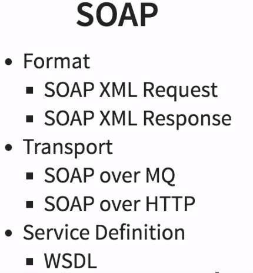
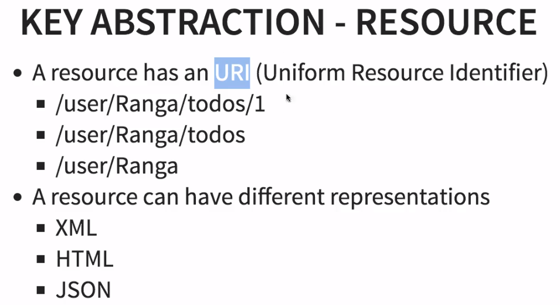
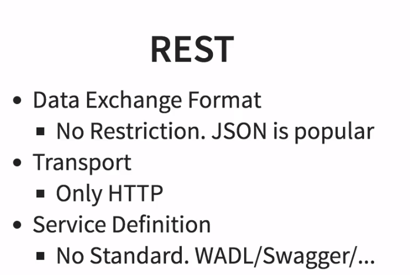
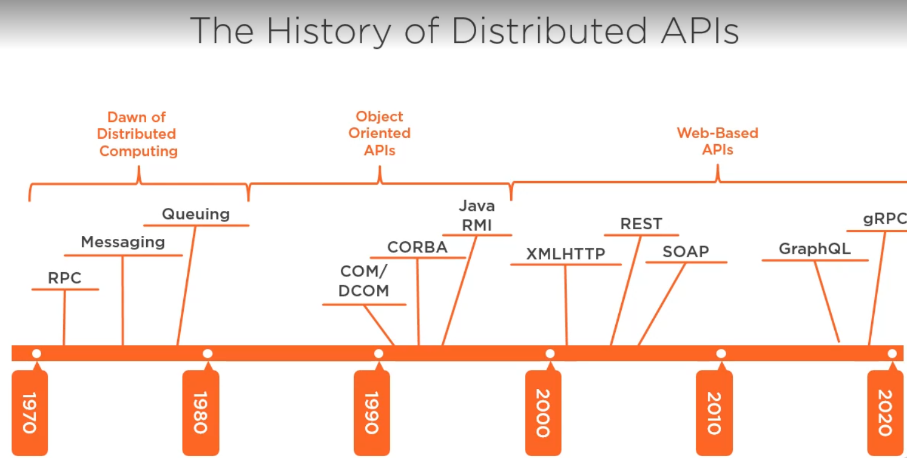
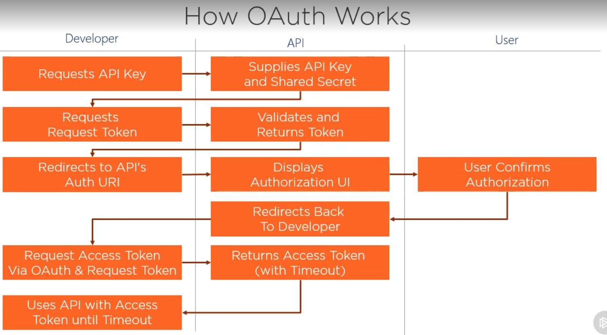

# Web Service
Software system designed to support interoperable machine to machine 
interaction over a network

## SOAP WebService
Simple Object Access Protocol
* Use xml for exchange data
* Soap has envelope to define data exchange format with xml
* It has header and body. Header is optional and useful for authentication , authorization
* WSDL defines operations, endpoints, request and response structures
<br>


## Rest WebService
Stands for Representational State Transfer
Rest wants to best use of HTTP.
HTTP is Hyper Text Transfer Protocol defines the standard of the communication in web.
* Http defines request header, body also has methods and status codes.
* A key abstraction in REST is resource. It is anything that you want to expose to the world.
For example user, a list of user
<br>

<br>

<br>


Concepts include
* Seperation of client and server
* Stateless client-server communication, meaning no client information is stored between get requests and each request is separate and unconnected.
* Cacheable data that streamlines client-server interactions.
* Uniform interface

### Designing REST API
We prefer nouns over verbs
> For ex: not getCustomers, getProducts
> <br>
> Use -> /customers, /products

Use unique identifiers in URI
> /sites
> /sites/1
> /sites/uk-cou

Use for non-resource properties in Query Strings
> /sites?sort=name
> /sites?page=1
> /sites?format=json

#### Design Verbs
* GET -> retrieve a resource
* POST -> add a new resource
* PUT -> update an existing resource
* PATCH -> update a resource with changes
* DELETE -> remove existing resource
When a client needs to replace an existing Resource entirely, they can use PUT. When they're doing a partial update, they can use HTTP PATCH.

#### Decide formats during design
```
// Accept Header
Accept: application/json, text/xml
```
```
// Return same default(usually json)
Content-Type: application/json
```
```
// Prefer not to use query strings for formats
/api/customer?format=json // antipattern
```

#### Paging
Lists should support paging
Query strings are commonly used:
```
/api/sites?page=1&page_size=25
```
Use wrappers to imply paging:
```
{
    totalResults: 255,
    nextPage: "/api/sites?page=5",
    prevPage: "/api/sites?page=3"
}
```

### Error Handling
* Return object with error info
```
400 Bad Request
{error: "Failed to supply id"}
```
Not every time recommended. For ex: error with sensitive informations

### Design Caching
Use http caching. no idea about it.

#### Versioning API
Requirements will change.
* API versioning is harder, needs to support both new and old.

The approaches:
<br>
Versioning with uri path

> api/v2/customers
>> Pros : very clear to clients
>> Cons: clients need to change the uri every time

Versioning with query string
> api/customers?v=2.0
>> Pros : versioning is optionally included
>> Cons: too easy for clients to miss needing version

Versioning with header
> X-Version: 2.0
>> Pros : seperates versioning from the API
>> Cons: developers need to manipulate headers

Versioning with accept header
> Accept: application/json;version=2.0
>> Pros : no need to create your own custom header
>> Cons: less discoverable than query strings

#### Security
Cross Domain Scripts not allowed for most browser.
<br>
CORS -> Cross Origin Resource Sharing

#### Authentication
There are 4 ways to do it.
Cookies, Basic Auth, Token Auth, Oauth

> Cookies: easy to use and common. But hacking is also is, not so secure. Depends on your use case.

> Basic auth: easy to implement. not secure we send credentials in every request in query string.

> Token auth: most common, secure, should expire must faster than cookies. Clients send data to server,
server returns token. Client then sends request with that token, server validates it.
JWT

> Oauth -> use trusted 3rd party to identify.


## SOAP vs REST
* Soap uses XML, REST can use Json, XML, HTTP

## Graphql, gRPC
