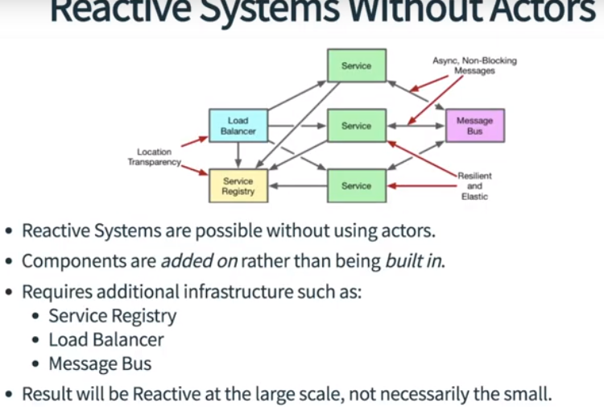

# What is Reactive Systems?
If you look at the past say 10 or 15
years in software development you'll see that a lot has changed.
 
For example software installation made on 3-4 nodes, 10-15 if it size is large.
 
 
Also the amount of the data has changed. We handle gigabytes of data. Most of
the data was at rest. What we mean by at rest
is the data would typically not be changing actively. 
 
 
What would happen is
you'd have maybe a batch job or something that would run once a day, pull
in a bunch of data and then that data would remain fairly static for a period
of time.
 
 
We also had long maintenance windows. So when we look at older systems
it wouldn't have been uncommon to try to access that system and see a message
like this is down for maintenance please check back in a few hours. Those types of
scenarios were fairly frequent.
 
 
If we look at the newer systems, we deploy our software to hundreds or thousands of nodes.
And we need to deal with the petabytes level of data and it is changing constantly.
 
 
The other thing too is that we're now
looking at a hundred percent time, or at least close enough to a
hundred percent that it doesn't really matter either way.
 
 
It's no longer
acceptable to see a service or a website where you go and get that message that
says it's down for maintenance.we just have to figure out
different ways to do it. 
 
 
So that's the nature of the change that has happened
but when we talk about that we're talking really about technical problems.
We're talking about the size of your installation. We're talking about the
amount of data in that installation. We're talking about, you know, deployments
and database scripts. Those are all very technical problems and the reality is
that the problem that we're trying to solve is actually not technical at all.
 
 
What we're trying to actually solve is a change in modern user expectations. Those
other things that we talked about our consequences of the change. So the actual
change is that modern users have come to rely on software to do their jobs and to
live their day-to-day life. You think about what happens, what is the impact on
a person if a critical service is down for a few hours?
 
 
Think about yourself for example, maybe at work: if you're at work and you lose
access to some of your critical services how does that affect your day-to-day
workflow? For example, if you were to lose access to something like Google, or
github, or Stack Overflow, Slack, email, any of these things? If they go down for a
few hours, what does that do to your workflow? It may have a dramatic impact
if it's something that you use on a regular basis.
 
 
The other thing too
is how long do these pieces of software to take to respond? 
 
 
When you do a Google
search it responds very very quickly. Imagine for a moment if that wasn't the
case. Imagine if instead of responding almost instantly it took 30 seconds or a
minute to respond. How would that impact your day-to-day life?
 
 
The reality is that
users don't want to wait for a response. They don't want to sit there and click
on a page and then have wait a minute while it refreshes.
 
 
if you're
constantly going to a website or using a service that is giving you messages
saying this is down for a little bit please check back later; or maybe you
click on something and every time you click on something it takes a minute to
refresh; that's gonna lead to a very dissatisfying experience.
 
 
Unresponsive
software, as a result, leads to user dissatisfaction. The fact of the matter
is you've heard the phrase before "time is money"; it's true, time is money. We
spend a lot of money trying to find ways to make people more efficient. And so if
you have software that is slow or unavailable, that's inefficient. Users are
gonna start looking for other alternatives.
 
 
They're gonna find better,
faster software. So if you are a company that is building software that is
unresponsive in any way and your users start looking to your competitors, if
your competitor can provide the same features with better responsiveness,
guess what your users are gonna do? They're gonna go to your competitor.
 
 
The primary goal of reactive architecture is to provide an
experience that is responsive under all conditions. That is the core thing that
we are trying to achieve in reactive architecture

## Unresponsive Software
Think about some examples where you have encountered unresponsive software
* What was your reaction
* Did it make you reconsider to change the software

In 2017, Amazon S3 has shut down for a couple of hours. During these time most of
the web sites which uses this service has been unresponsive.
 
So, think about the users to enter those sites. Were they be happy for that?
They gonna blame you not AWS. Because they don't know you use AWS and even
they know they dont care.
 
 
In 2011 Playstation network experienced a security breach and they voluntarily suspend their 
services for 23 days. Think about you can't play for 23 days. Would you think to buy an Xbox?
 
 
In 2015, Bloomberg experienced software and hardware failures in their systems which
prevented their trading for a critical two hours. In high frequency trading two hours
is like 10 years. Millions of dollars can be exchanged. Preventing that
trading for that period of time can have drastic consequences. It could mean
loss of million dollars. So, a short period of time means so much for depending on the industry.

## The Goal

## The Reactive Principles
A group of people come together and tries to find a pattern to solve those problems.

## Reactive Programming

The reactive programming can be used to build reactive systems, and quite frequently
is used to build reactive systems, but just because you use reactive programming
doesnt mean you've created a reactive systems.

## The Actor Model
It's a reactive programming tool

https://www.lightbend.com/
http://www.reactivemanifesto.org/
https://www.lightbend.com/reactive-programming-versus-reactive-systems
https://info.lightbend.com/COLL-20XX-Going-Reactive-2016-Survey-Report_LP.html
https://www.lightbend.com/blog/understand-reactive-architecture-design-and-programming-in-less-than-12-minutes
http://doc.akka.io/docs/akka/current/scala/guide/actors-intro.html

## Examples of Reactive Systems
Two Generals Video provides a video streaming service. Videos are grouped into a playlist that can be watched in order. The system will keep track of which videos a user has watched, and which ones they have not. This way they can pick up where they left off.

Sometimes, when users log into the service, the option to continue from where they left off is missing. No error is provided, the option is simply gone. They can still watch all of their videos, so that functionality is still available.

This occurs because the backend service that tracks the users state has failed or gone offline for some reason.

In this scenario, which of the Reactive Principles is the software demonstrating?

> A failure has occurred, but the software isolates that failure in order to remain Responsive. This demonstrates Resilience. The system is not completely Resilient because a portion of the system is still unavailable. But we do demonstrate some Resilience.

# Reactive Architecture: DDD
Software has become an critical part of modern business. Today, all companies are software companies. And as companies grow, their systems grow with them. Over time, small problems become bigger, and soon projects begin to collapse under their own weight. We need tools that will allow us to take those large problems, and decompose them into something smaller, and more manageable.

Domain Driven Design provides techniques to analyze a problem in a more manageable way. This enables developers to focus on the task at hand, without having to worry about all the other complexities surrounding it. 

When you start looking at reactive architecture you'll often come across
the term domain driven design. Which refers to an architectural approach that
is used to design the large systems.

As far as goals go for domain driven design
one of the key goals within it is to take a large system, or a large domain
rather, and to break it into smaller and smaller pieces.

The problem that we have
with large domains is that they can be very hard to model. There's a lot of
rules, a lot of different things that we have to keep in mind when we're trying
to model a large domain. Trying to do that all in one single coherent model
can be very difficult or impossible in many cases so because of that we try to
break things down into small pieces. This gives us a way to determine boundaries
essentially between those smaller pieces within the larger domain.

Microservices,
reactive microservices specifically, have a similar goal: they need to be
separated along clear boundaries. In the case of reactive microservices those
boundaries need to be asynchronous: each microservice has to have a clearly
defined API and a specific set of responsibilities. If we don't know what
the responsibilities of the microservice are then it's going to be very hard to
build it and design it properly. 

The trick comes when
we try to determine what those boundaries are. There's no clearly
defined technique that will just give us the right answer all of the time however
this is where domain driven design can help us. It does give us a set of
guidelines and a set of techniques that we can use to try to help us break
larger domains into smaller domains. Because of that we can take that logic
and apply it to microservices to come out with something similar. 

If you
look at reactive frameworks such as Lagom for example Lagom on is built with
domain driven design in mind. It leverages some of its terminology. If you
look, for example, it has the concept of a persistent entity in Lagom that maps
directly on to the concept of an entity which comes from domain driven design.
Again we'll talk more about that a little later in the course. The key here,
the key here that we need to realize is that domain driven design can be used in
the absence of a reactive microservice or a reactive architecture. And you can
build reactive architectures without domain driven design but because the two are
very compatible--and they are, they do have similar goals--you'll often find
them use together.

## Summary
Often a single all-inclusive model of a very large domain can contain much, and at times overwhelming, complexity. Breaking those large domains into smaller pieces can result in making the complexity more manageable and understandable.

## Decomposition

## Domain Activities