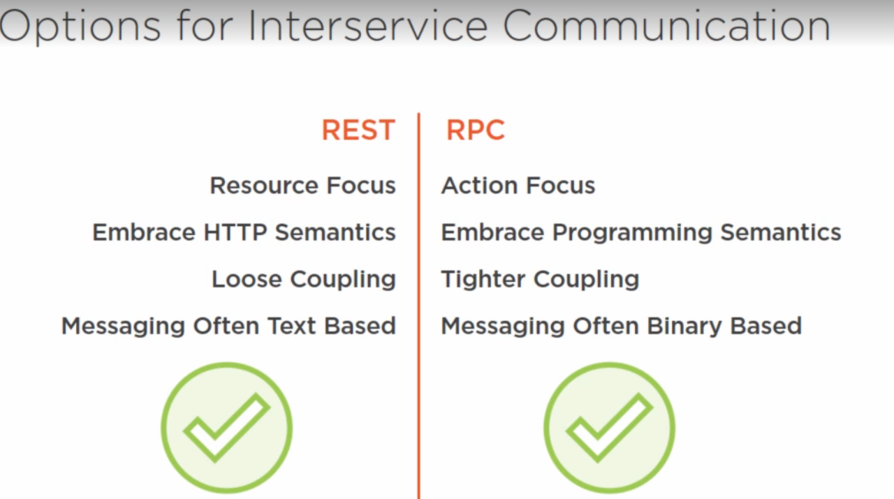
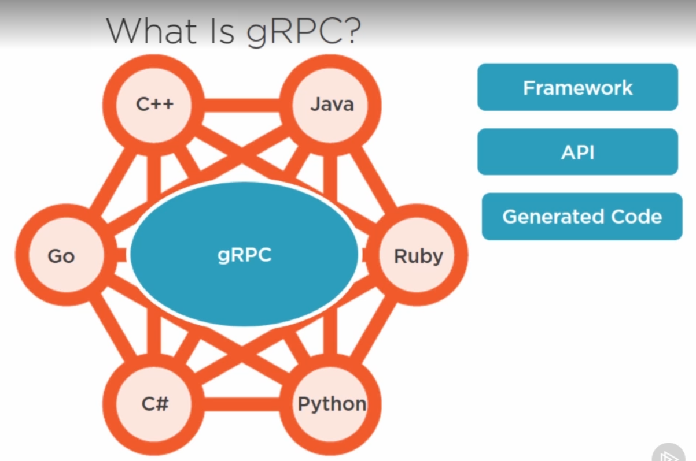

In rest we expose resource, in grpc clients calls a method from remote machine.
- This leads to a tight coupling because it needs to know more information, your function name, parameters etc.
- grpc sends data as binary so more performant than rest

## History
There was a product called stubby in google environment. It used to communicate googles services.
The problem with stubby is depends on google.

- They wanted to go stubby to the next level with the release of http2.

## Grpc background
- cross-platform
- scalable
- streaming
- free and open
- Strong typed messaging

