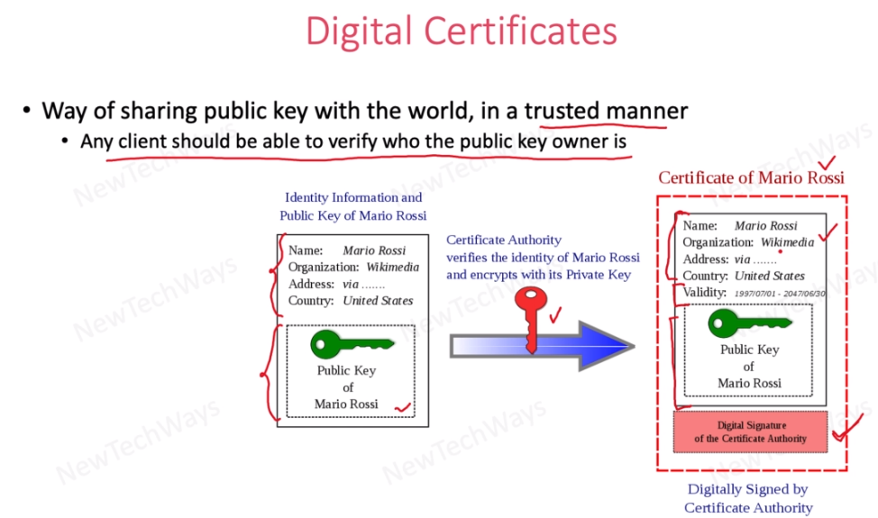

## Symmetric Key Encryption
- Encryption and decryption is achieved by same key.
- The key available in both client and server
- Symmetric key is efficient yet there is a question. How server will trust the clients to be able to share the key?
this is where public key cryp. comes in.

## Public Key Encryption
- Also called as asymmetric key enc. or public-private key  enc.
- There are two keys public and private. We enc. text with public key and only the private key holder
can see the data. It is valid for opposite.
- We achieve privacy(confidentiality), authentication

## Secure Network Communication
- When client wants to get data from server through https, it first request from web server
- Web server sends its public key
- Client generates a symmetric key from that public key and send it to server
- Server dec. it using its private key. This way server holds client keys
- Even if one attackers can achieve this sym. key, it can nor decr. because it doesn't have private key

Questions: 
Why we use symm. key
> symm. key algo. is very fast comparing to asym. algo.

Sym. key has drawback because its not secure to exchange it. But we have overcome that limitation by using public and private key combination

## Some Considerations
How clients know that it communicates with the right server. How can we guarantee that, server identity?
> With certificate

## Hashing
Another building block for cryptography algorithms

Importan concepts of hashing
- Its one way algorithm, means that if we hash password we can not get back the original input even we know hash function.
- Even if we change small thing in input like one character, output will be completely different
- SHA-2 commonly used

## Digital Signature

## Digital Certificates
The user send its info and public key to an authority and get a digital certificate.
 
User installs this certificate to his own web server.
 
Whenever a client sends a request to web server, clients browser downloads this certificate and verifies its.

Very similar to digital signature but the only difference is that digital certificate has public key in its content.

Certification authority is verifying user information like name, organization, address and etc.

## Authentication
Stateful, stateless authentication

### Stateful Authentication

Drawbacks:
- Scalability, session cache can grow

### Stateless Authentication
- Better scalability due to decentralized
Drawback
- Anyone has token can access the services. Use ttl

## Single Sign On
We're gonna understand how we use stateless auth. using sso.
 
When a client connected to the system for the first time they'll be routed to the auth server and it 
will provide a token.
 
We use bearer token to connect services. Its a type of token that usually be used by services.

## Access Management
## Role Based Access Management
 

## Authorization
Oauth2

### Oauth2 Token types
- Bearer: its simple to implement, drawback is anyone who has this token can access the resource. The token doesn't hold info for spesific person. Think it like cinema ticket
- MAC: spesific to a person, more secure. Think it like air ticket

### JWT
- JSON based token spesification
- Alternative is SAML tokens. Its based xml
- May or may not be encrypted

### Token Storage
Where client should store token?
 

## Secure Data At Rest
Means that securing data that exist on some persisten storage

- Use hash function to hash password and store hashed data in db. When a user types a password, we hashed it and
then compare it with db value.
- Transparent Data Enc: data enc. in hdd. For ex data stored in db are enc. when we query, data dec. and we see original data
- Client data enc: client has a key and it enc. data

## Securing a System

