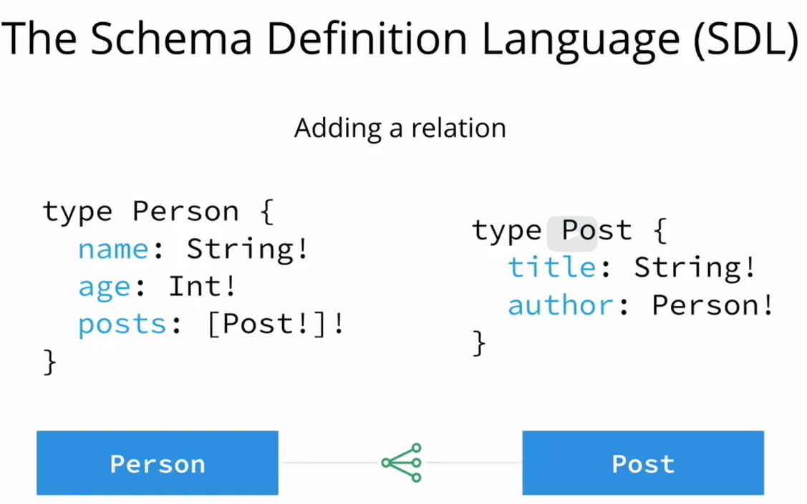
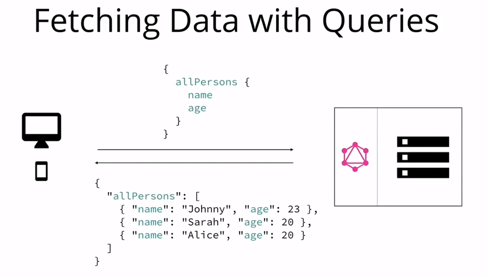
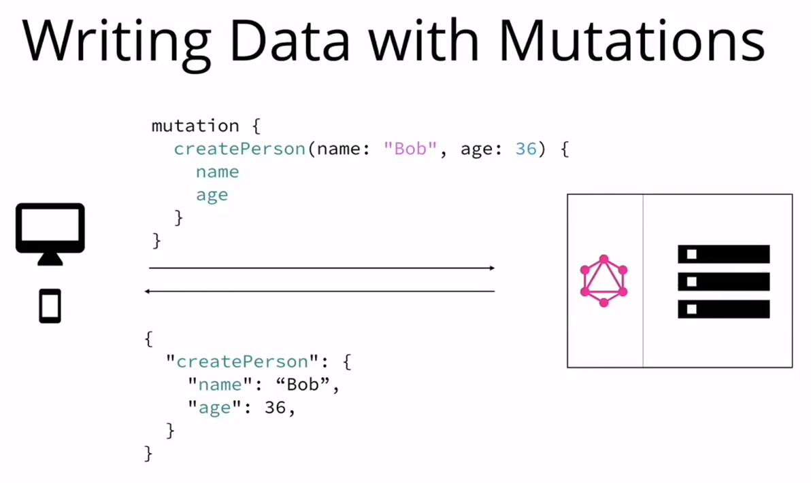
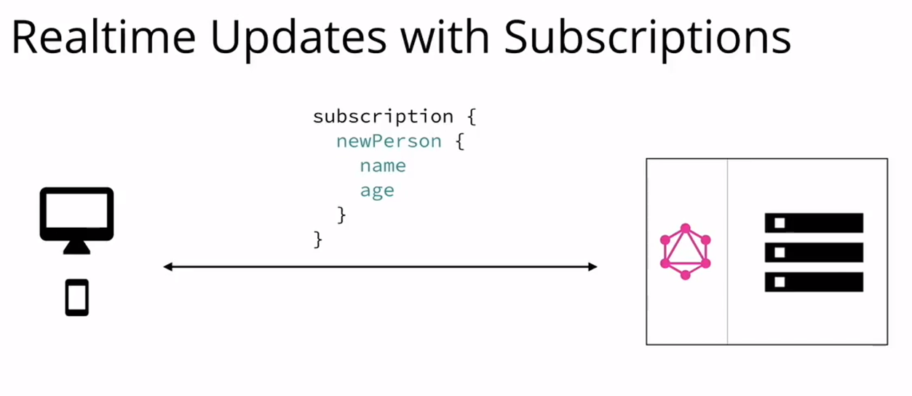
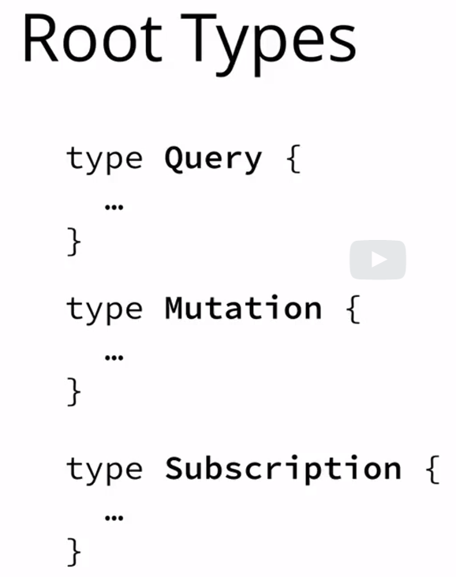
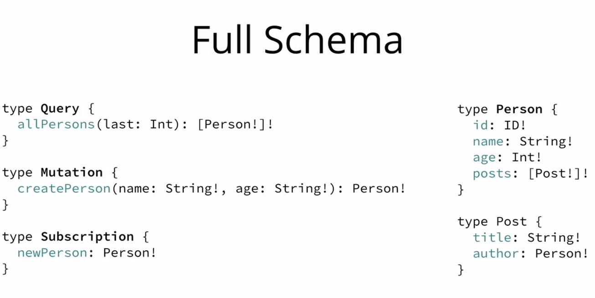
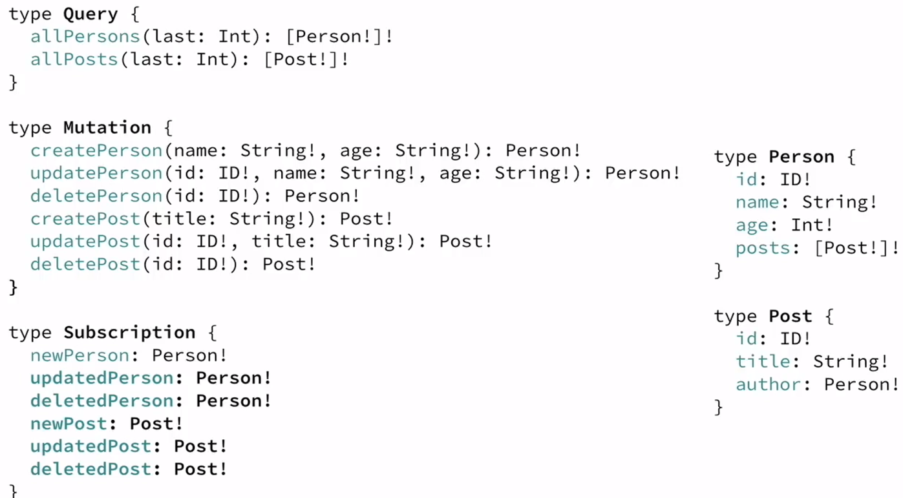
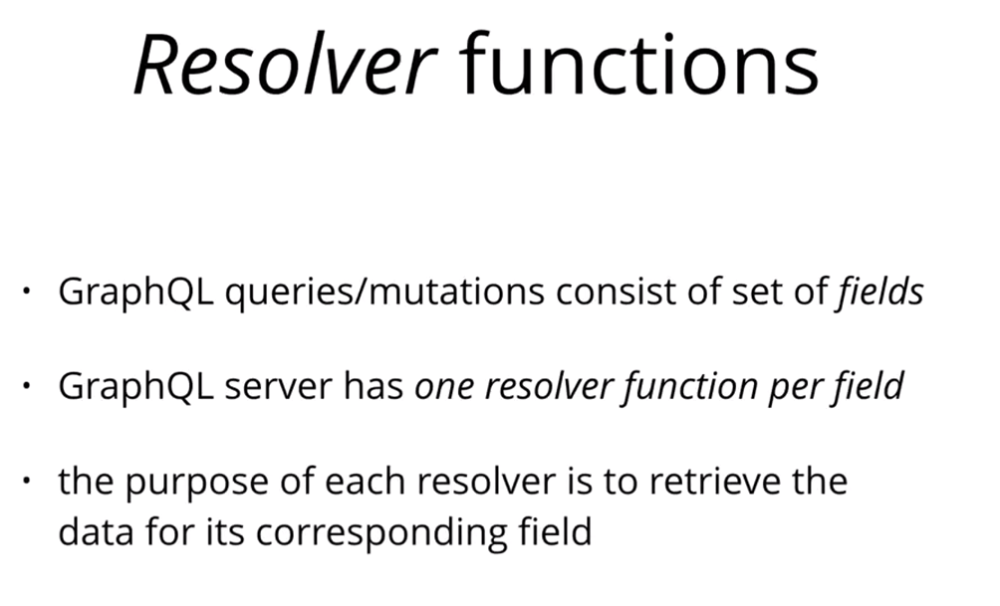
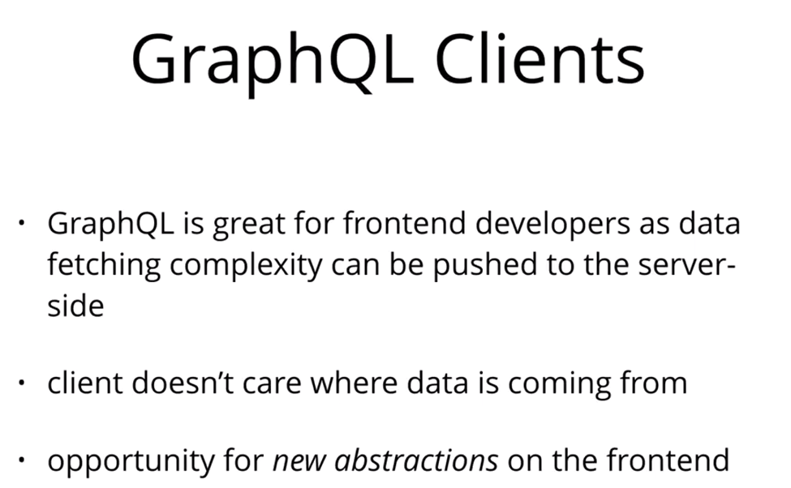

## Concepts
SDL

- Define a one to many relation


- Queries to get data


### Mutations
3 kinds of mutations
- creating new data
- updating existing data
- deleting existing data



### Subscriptions
It is like websocket connections



We put all together to define an API to create a contract between client and server







### Queries With Arguments
In GraphQL, each field can have zero or more arguments if that’s specified in the schema. For example, the allPersons field could have a last parameter to only return up to a specific number of persons. Here’s what a corresponding query would look like:

```
{
  allPersons(last: 2) {
    name
  }
}
```

# Architecture
Graphql is a specification. You need to create graphql server

## Resolver functions


## Graphql clients


# Graphql Client
There are two major GraphQL clients available at the moment. The first one is Apollo Client, which is a community-driven effort to build a powerful and flexible GraphQL client for all major development platforms. The second one is called Relay and it is Facebook’s homegrown GraphQL client that heavily optimizes for performance and is only available on the web.