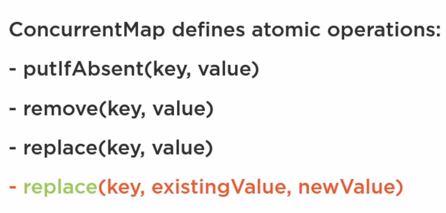
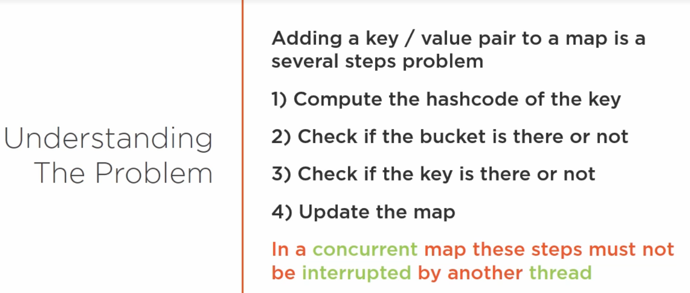
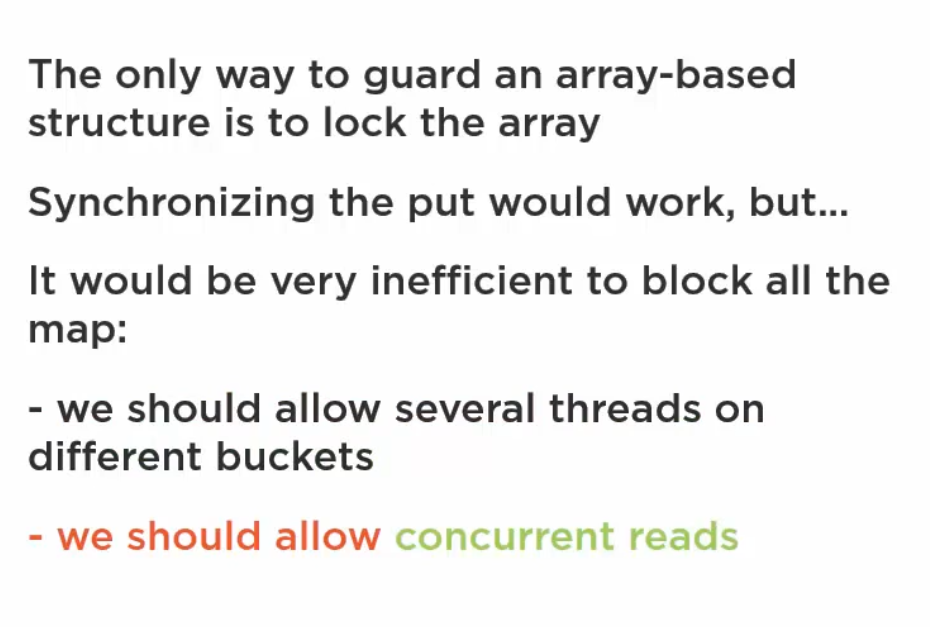
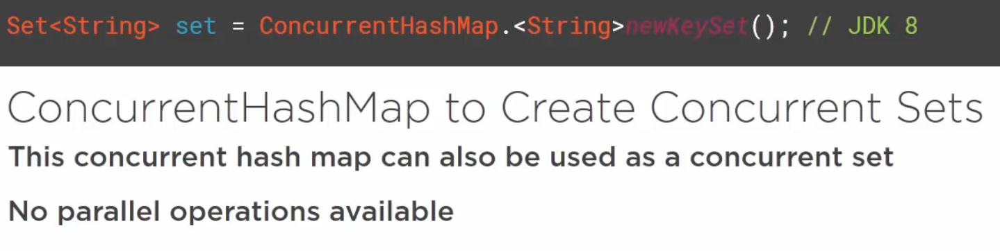
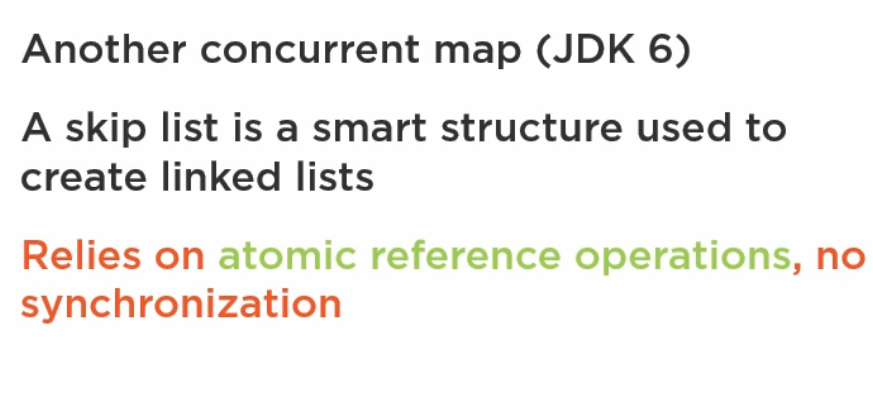
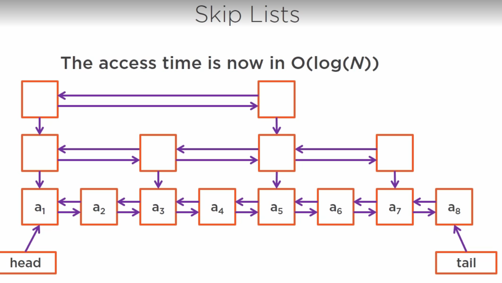

## CyclicBarrier
A CyclicBarrier is a synchronizer that allows a set of threads to wait for each other to reach a common execution point, also called a barrier.
<br>
CyclicBarriers are used in programs in which we have a fixed number of threads that must wait for each other to reach a common point before continuing execution.
<br>
The barrier is called cyclic because it can be re-used after the waiting threads are released.

## CountDownLatch
Usefull for things like wait for all threads to complete then startup the application.
latch.countDown() method used in task and whenever threads run this task it decreases the latch.
<br>
In the main thread we just say    latch.await(); and within this way main thread is waiting on CountDownLatch to finish.

## Difference between CountDownLatch and CyclicBarrier
In our last article, we have to see how CountDownLatch can be used to implement multiple threads waiting for each other. If you look at CyclicBarrier it also does the same thing but it is different you can not reuse CountDownLatch once the count reaches zero while you can reuse CyclicBarrier by calling the reset() method which resets Barrier to its initial State. 

What it implies that CountDownLatch is good for one-time events like application start-up time and CyclicBarrier can be used in case of the recurrent event like concurrently calculating a solution of the big problem etc. If you like to learn more about threading and concurrency in Java you can also check my post on When to use the Volatile variable in Java and How Synchronization works in Java.

## Semaphore
Restrict the number of threads that can access a resource. Example, limit max 10 connections to access a file simultaneously.
<br>
We can use semaphore as lock object.
```
BoundedSemaphore semaphore = new BoundedSemaphore(1);
semaphore.take();

try{
  //critical section
} finally {
  semaphore.release();
}
```

```
   // 5 tickets
    Semaphore semaphore = new Semaphore(5);

    // take 1 ticket 
    semaphore.acquire();
 
    // 4
    semaphore.availablePermits();
    
    // return back ticket
    semaphore.release();
 
    // 5
    semaphore.availablePermits();
```
## Mutex
Only one thread to access a resource at once. Example, when a client is accessing a file, no one else should have access the same file at the same time. Mutex is the Semaphore with an access count of 1.
Mutex is just a synchronization nothing much more.

## Intrinsic lock
Every object in Java has an intrinsic lock associated with it. The synchronized method and the synchronized block use this intrinsic lock to restrict the access of the critical section to only one thread at a time.


## CAS (Compare and Swap)
* A low level functionalities given by the CPU that are exposed at the API level.
So we can use them in our app.

# Concurrent Collections
## Copy On Write
* No locking for read operations
* Write ops. create new copy and replace with the old one.

CopyOnWriteArrayList, CopyOnWriteArraySet
> Works well many reads, very few writes.

## Queue and Deque
* ArrayBlockingQueue a bounded blocking queue built on an array
* ConcurrentLinkedQueue: an unbounded blocking queue
What happens when the queue is full and we want to add element or queue is empty and we want to consume?
Two things happens, either get an exception or get a false value. for blocking queue we'll be blocked.

## ConcurrentMaps
Two implementations in JDK
* ConcurrentHashMap
* ConcurrentSkipListMap



Understanding the implementation
* Needs to be thread safe
* Needs to be efficient up to a certain number of threads
* Needs to support a number of efficient, parallel special operations.




There is no mechanism to lock a portion of the array in Java. We need to lock the whole array.



What did in JDK is that synchronized the part of the segment instead synchronized the whole array.
This is how ConcurrentHashMap works. 
* The implementation has changed in the JDK 8. Parallel methods implemented and can handle heavy concurrency.



## Concurrent Skip List



## Concurrency vs Parallelism
Concurrency is about dealing with lots of things at once. Parallelism is about doing lots of things at once.
concurrent system need not be parallel, whereas a parallel system is indeed concurrent.
<br>
The classic example of a concurrent system is that of an operating system running on a single core machine. Such an operating system is concurrent but not parallel. It can only process one task at any given point in time but all the tasks being managed by the operating system appear to make progress because the operating system is designed for concurrency. Each task gets a slice of the CPU time to execute and move forward.
<br>
A parallel system is one which necessarily has the ability to execute multiple programs at the same time. Usually, this capability is aided by hardware in the form of multicore processors on individual machines or as computing clusters where several machines are hooked up to solve independent pieces of a problem simultaneously. Remember an individual problem has to be concurrent in nature, that is portions of it can be worked on independently without affecting the final outcome before it can be executed in parallel.

> Liveness: Ability of a program or an application to execute in a timely manner is called liveness. If a program experiences a deadlock then it's not exhibiting liveness.

> Live-lock: A live-lock occurs when two threads continuously react in response to the actions by the other thread without making any real progress. The best analogy is to think of two persons trying to cross each other in a hallway. John moves to the left to let Arun pass, and Arun moves to his right to let John pass. Both block each other now. John sees he's blocking Arun again and moves to his right and Arun moves to his left seeing he's blocking John. They never cross each other and keep blocking each other. This scenario is an example of a livelock. A process seems to be running and not deadlocked but in reality, isn't making any progress.

> Starvation: Other than a deadlock, an application thread can also experience starvation, when it never gets CPU time or access to shared resources. Other greedy threads continuously hog shared system resources not letting the starving thread make any progress.

> One likely scenario can be that the variable is updated with the new value in the processor's cache but not in the main memory. When another thread running on another core requests the variable myVariable's value from the memory, it still sees the stale value of 0. This is a specific example of the cache coherence problem