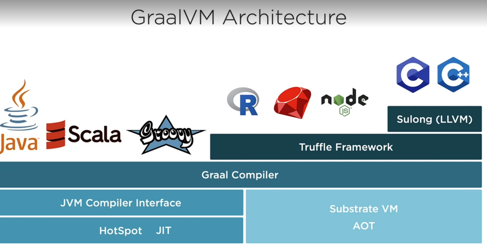
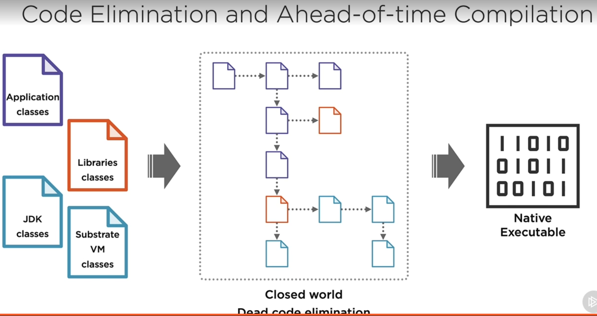
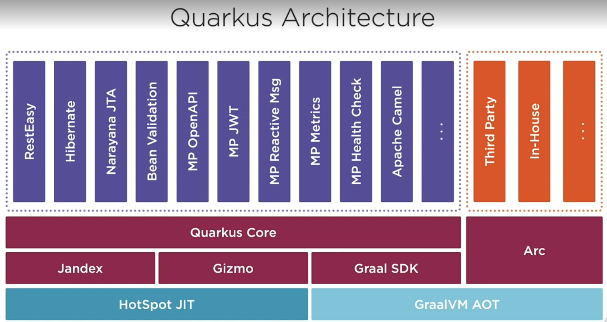
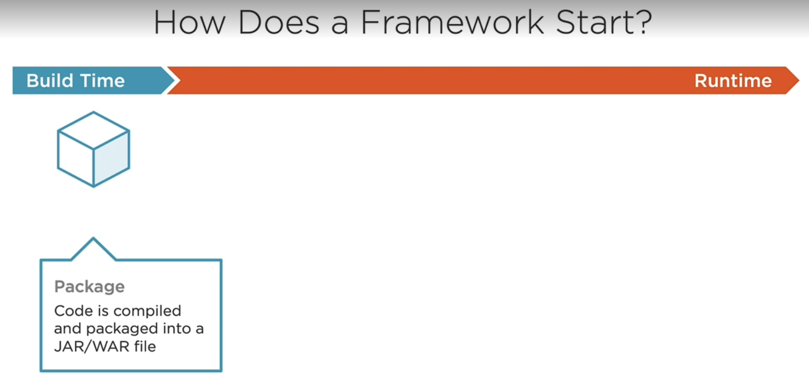
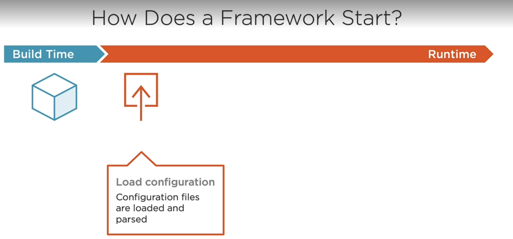
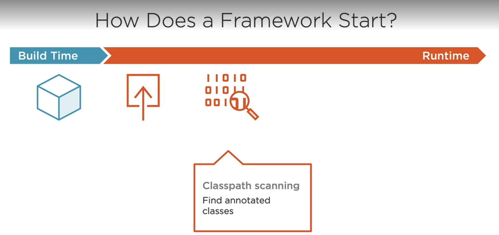
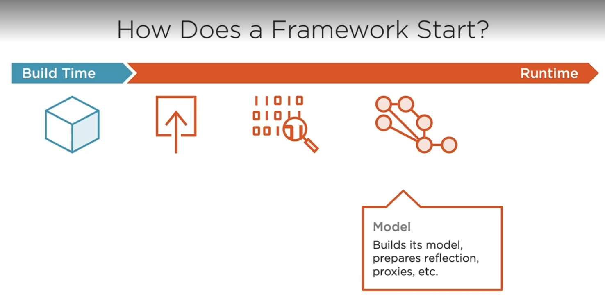
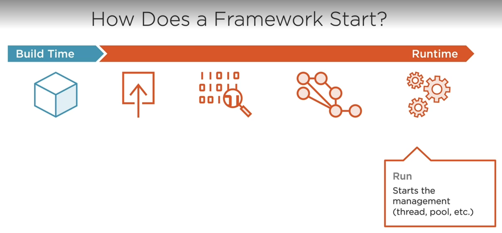
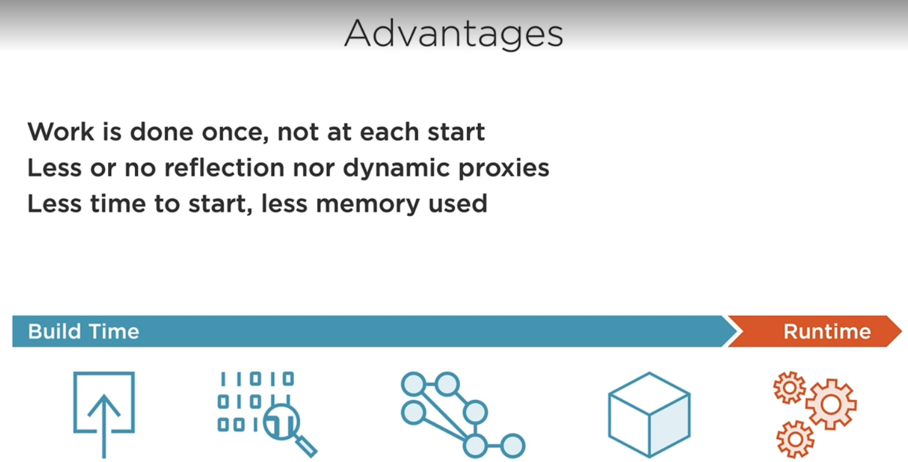
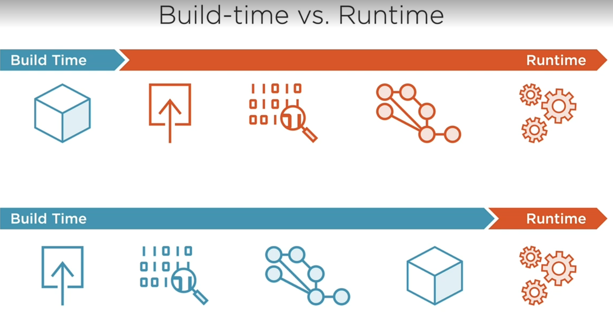

Quarkus is a Java runtime with a focus on developing microservices to run on Kubernetes.

```
A "runtime" is an execution environment that includes a collection of
packaged frameworks that collectively support a developer’s application logic.
Java EE (now Jakarta EE ) application servers, Spring Boot, 1 and Quarkus are
all examples of Java runtimes since each is a Java execution environment
that includes Java frameworks that support application logic.
```

## The need for microservices specifications
Java EE has been the standard-bearer for enterprise Java specifications for roughly 20 years.
However, Java EE has been traditionally focused on 3-tier monolithic architecture with a steady,
measured evolution and a strong focus on backward compatibility. Java EE stopped evolving
between 2014 and 2017 just as the industry began to heavily adopt microservices.
During that pause, the Java EE community began to experiment and deliver early microservices
APIs. There was an increasing risk of API fragmentation across Java runtimes that had been
known for application portability. In addition, there was a risk of losing reusable skills. For
example, Java EE APIs like JPA and JAX-RS are used with non-Java EE platforms like Spring
and Dropwizard, making it easier to switch to a Java runtime that better meets businesss criteria.
To avoid fragmentation and loss of reusable skills, the community made the decision to
collaborate on microservice specifications.

## Eclipse MicroProfile
To avoid Java API fragmentation and to leverage the collective vendor and community
knowledge and resources, MicroProfile was founded in June 2016 by IBM, London Java
Community (LJC), Payara, Red Hat, and Tomitribe. The tagline "Optimizing Enterprise Java for
a Microservices Architecture" recognizes that Java offers a solid foundation for building
microservices. MicroProfile extends that foundation through the creation and evolution of Java
API specifications for well-understood microservices patterns and cloud-related standards. These
common APIs can be used by multiple frameworks and implementations, or runtimes.

## Quarkus
Quarkus is a Java microservices runtime. Does the industry really benefit from yet another Java
microservice runtime? Yes! To understand why, let’s take a look at some inherent problems with
existing runtimes.

Quarkus is a Java microservices runtime. Does the industry really benefit from yet another Java
microservice runtime? Yes! To understand why, let’s take a look at some inherent problems with
existing runtimes.

<p>

Most Java microservice runtimes utilize existing frameworks that were developed for shared
environments like application servers, where each application had its own set of requirements.
These frameworks are mature and still very relevant, but haven’t fundamentally changed since
the mid 2000’s and continue to heavily rely on dynamic runtime logic using Java reflection.
More specifically, no substantive optimizations have been made to these frameworks for Java
microservice runtimes. The result is high RAM utilization and slower startup time due to a large
amount of work at application startup.

<p>

Another pain point is that developer productivity often suffers with Java microservice runtimes.
Every time a developer makes a change they have to save the file, rebuild the application, restart
the application, and refresh the browser. This can take 10s of seconds, significantly impacting
the productivity of a developer. Multiply that by the developers in a team over time, and it
quickly equates to a large sunk resource cost for an enterprise.

<p>

Developers and DevOps teams began to feel the pain of developing and deploying Java
microservices, and have been increasingly considering alternatives like Node.js and Golang due
to their reduced RAM requirements and fast startup time. These alternatives can also achieve a
5x to 10x deployment density on the same hardware, significantly reducing cost.
Quarkus is a Java runtime that takes a fresh look at the needs of the modern Java microservice
developer. It is designed to be as productive as Node.js for developers, and consume as few
resources as Golang. To many developers, Quarkus feels both new and familiar at the same time.

<p>

It includes a lot of new, impactful features while supporting the APIs that developers are already
familiar with.
When developing microservices, runtimes often do not consider the target environment. Most
runtimes are deployment environment agnostic to be broadly relevant. While Quarkus is used in
a wide variety of deployment environments, it has specific enhancements and optimizations for
Linux containers and Kubernetes. For this reason, Quarkus is referred to as Kubernetes Native
Java.

## MicroProfile Support
Quarkus is a Java runtime with a focus on developing microservices to run on Kubernetes.
MicroProfile is a collection of Java specifications for developing microservices. Therefore, it is a
natural fit for Quarkus to implement MicroProfile specifications to facilitate microservices
development. Also, developers can re-host their existing MicroProfile applications on Quarkus
for improved productivity and runtime efficiency. Quarkus is continually evolving to stay current
with MicroProfile releases. At the time of this writing, Quarkus supports MicroProfile 3.3 as
described in Section 1.2 - Eclipse MicroProfile and all standalone MicroProfile specifications.
Besides CDI and MicroProfile Config, which are included in the Quarkus core, each
MicroProfile specification is available as a Quarkus Extensions that can be included using
Maven dependencies.

## Summary
* Quarkus has become well known for its fast startup time and low memory usage, earning its
"Supersonic, Subatomic Java" marketing tagline. Quarkus can run applications on the JVM. It
can also compile the application to a native binary using GraalVM Native 5 Image.

* A microservice models and implements a subset of business functionality called a
bounded context.
* A microservices architecture is a collection of evolving, collaborating microservices.
* MicroProfile is a collection of microservices specifications that facilitate the creation of
portable microservices across multiple implementations.
* Microservices have evolved from running in a shared environment like an application
server to running on a single application stack.
* Kubernetes has replaced the application server as the shared application environment
* Quarkus is a Java single application stack that can efficiently run MicroProfile
applications on Kubernetes.

# Creating a Native Executable
Java programs require a Java Virtual Machine (JVM), as their operating system, for execution.
The JVM includes all the low level Java APIs wrapping operating system libraries, as well as
convenience APIs to simplify Java programming. The JVM, including all the APIs it provides, is
not small. It occupies large parts of memory, measured by its Resident Set Size (RSS), when
running Java programs.

<p>

Native executables are files containing programs to be executed directly on an operating system,
only relying on operating system libraries to be present. Embedded within them are all the
necessary operating system instructions required by a particular program. The key difference
between a native executable and Java programs is that there is no requirement for a JVM to be
present during runtime execution.

<p>

The ability to compile a Java program down into a native executable significantly reduces the file
size of the program because the JVM is no longer required. It also significantly reduces the
amount of RSS memory used while executing, and shortens the time required to start the
program.

```
The reduction in the program size is a result of the dead code elimination
process. There are several aspects of this that impact how code can execute
inside a . A key difference is that dynamic native executable class loading will
not work, because non directly referenced code is removed from the native
executable. Full details of what won’t work in a native executable can be
f o u n d o n t h e G r a a l VM

```

Over the last couple of years a part of the GraalVM project offering compilation to native
executable has become popular. GraalVM might sound familiar because of the Truffle compiler
sub-project offering polyglot programming on the JVM, but the compilation of Java down to
native executable is from a different sub project.
native executables are particularly beneficial in serverless environments where processes need to
start promptly, and require as few resources as possible.

<p>

Quarkus offers first class support for native executable creation and optimisation. Such
optimisation is possible through Ahead of Time (AOT) compilation, build time processing of
framework metadata, and native image pre boot.

```
Ahead of Time refers to the process of compiling Java bytecode to a native
executable. The JVM only offers Just in Time compilation.
```

Metadata processing at build time ensures any classes required for initial application deployment
are utilized during the build, and are no longer required during runtime execution. This reduces
the number of classes needed at runtime, providing the dual benefits of reduced memory
utilization and faster startup time.

```
Examples of metadata processing include processing persistence.xml, and
defining required processing based on annotations in the code.
```

Quarkus further reduces the number of classes needed at runtime in a native executable by
performing a pre boot when building the native image. During this phase, Quarkus starts as much
of the frameworks as possible within the application and stores the serialized state within the
native executable. The resulting native executable has therefore already run most, if not all, of
the necessary startup code for an application, resulting in further improvement to startup time.

<p>

In addition to what Quarkus does, GraalVM performs dead code elimination on the source and
packaged libraries. This process will traverse all execution paths of the code to remove methods
and classes that are never on the execution path. Doing so both reduces the size of the native
executable, and the memory required to run the application.

```
Within a native executable there is still garbage collection, though it uses
different garbage collectors than the JVM. One impact of this is very
long-running processes will see better memory performance over time with
the JVM instead of native executable, due to the JVM continually optimizing
memory utilization.
```

## Quarkus Features
* Polyglot means support several languages
* Container first
* K-native and cloud native

## Purpose of Quarkus
Quarkus pushes java to the cloud.

Yesterday
* Java is born in 1995, designed for developing GUI apps. Works on single core and multi thread
* Over the time java was used by developing server side apps. monolithic apps.
* Running on huge machines 24/7 and startup time was not an issue
* Huge memory used by the JVM

Today
* Small machines, running on multi cores
* Deploy hundres of microservices
* Stop and start them quickly
* Instead of adding more hardware resource we add more machhines
* We need small binaries and small footprints and low resource consumptions

## How Quarkus Works
### GraalVm
* Is an extension of the JVM to support more languages and several execution modes. (Polyglot)
* Implemented in Java
* Running an application inside JVM comes with startup and footprint costs
* To improve that Graalvm has a feature to create native ../images for existing java applications
* This results in a fast startup time and low memory footprint

Architecture
<br>
At the heart Graal Compiler, its a high performance compiler written in java.
<br>
It accepts the JVM bytecode and produces both dynamic and static compilation
<br>
On the dynamic side it uses the new JVM compiler interface to communicate with the goold
old Hotspot VM.
<br>
The Hotspot jas a just in time compiler known as JIT, which starts interpreting the code
and compiles it. Hotspot support all the JVM languages like java, scala, groovy
<br>
On the other side for static compilation Graal compiler relies on Substrate VM.
It allows Ahead of Time compilation for apps. written in various languages.
<br>
This AOT improves startup time by loading precompiled classes.
<br>
On top of that Truffle framework exist. It enables you to build interpreters and implementations
for other languages lie R, ruby, javascript, python.
<br>
SuLong for LLVM languages like C and C++
<br>
Quarkus interest most AOT



<p>
When we develop app. we have a business class, external libraries and JDK classes and some necessary components 
from Substrate vm. At the end thousands of classes.
<p>
Before compiling natively, the image generation process employs static analysis to find any
code reachable from the main Java method. This reachable classes form what's called
the closed world. Then, its just a matter of eliminating all the classes
and methods that are not used by your application. This is called dead code elimination.
<p>
Thanks to the AOT, the remaining java code is compiled into a standalone executable called
a native executable or native binary.
<p>
Thanks to dead code elimination, the final executable is smaller. And thanks to AOT
the resulting native binary contains apps in machine code ready for its immediate execution.
<p>
The end result is an app that is faster to start and uses a smaller amount of memory
This is why Quarkus is great for cloud native and serverless.



## Quarkus Architecture
Quarkus does a lot of things, persistence, transaction, microservices, reactive messaging and so on.
So, you might think its core is huge and implements hundreds of features. But not
<p>
Quarkus is made of a small core on which relier hundreds of extensions. In fact, the power
of quarkus is its extension mechanism.
<p>
The core of Quarkus and this extensions mechanism is heavily based on Arc, a lightweight
dependency injection framework.
<p>
The core of Quarkus also does the hard work of rewriting parts of the app. at build time.
<p>
For that, it uses a set of tools such as Jandex, which is the java annotation indexer and reflection
library to optimize processing.
<p>
Gizmo is a library used to produce Java bytecode
<p>
Graal SDK, provides single class loader and dead code elimination mechanism.
<p>
Ok, where is the trick here?
 
> Quarkus uses Jandex to index classes and Gizmo to produce bytecode, but at build time, not at runtime.
That makes a huge difference.



## Build Time vs Runtime
Quarkus is fast and consumes less resources than most Java frameworks because it processes the code at build time instead of at runtime. Let's see why it matters. If you come from the Jakarta EE of Spring world, you know that most of the work of an application server is performed at runtime, not at build time. In fact, in a typical Java framework, at build time, we only compile and package our code into a JAR or WAR file and deploy it. 




Then we wait for the application server to start, and why do we have to wait? Because first, the server has to load the configuration of the application, it looks for all the configuration files from several JAR files, passes them, and loads them. 



Then it does classpath scanning. This means that it has to find all the annotated classes in all the JAR files. 



Then it builds the class model. This means that it prepares the classes for reflection, create proxies, and generate Bytecode if needed. 



Then finally, the application is ready and can accept requests, but as you can see, we have to wait for the server to complete all these tasks. 



Quarkus goes the other way around. When a Quarkus application is built, some work that usually happens at runtime is moved to the build time. When you compile the Quarkus application, the configuration files are loaded and passed. The classpath scanning is made, and the index created, the same index that will be used at runtime, thanks to Jandex. Then it does the annotation discovery, declares which classes need reflection at runtime, and generates started proxies to avoid reflection, thanks to Gizmo. And everything is packaged into a JAR file. So when Quarkus starts, most of the application has been precomputed, all the annotations scanned, all the XML passed, and so on. These are several benefits. The first one is that all the work is done once at build time and not at each start so you don't waste time waiting each time you startup Quarkus. As much as possible, Quarkus tries to avoid reflection or dynamic proxies. Instead, it generates the need by code at build time. All in all, all these optimizations reduce startup time and memory usage. 



If you compare both strategies, the one used by traditional Java frameworks in Quarkus, you realize why applications start much faster. Traditional servers take too much time booting because they have to do more processing before being able to handle the first requests. Quarkus starts quickly, and this is on our spot. When compiler will grab VM in building a native binary, then Quarkus boots even faster, but how fast?

