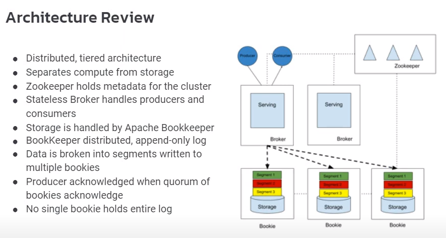

## Kafka Problems
* Adding a broker or a partition is not trivial and full of operational headaches
* One vendor dominated OSS community limits ability for OSS core to offer comprehensive solutions
* Looking at the history most messaging systems were made to solve yesterdays problem.
> JMS , ActiveMQ, RabbitMQ, Kafka, Pulsar 
* If you just use Kafka for messaging then use RabbitMQ instead. Because Kafka is much more than message queue,
and the companies use it for not just messaging solution also a streaming solution.

## What is good for Pulsar
* Multi region, multi-dc like Cassandra. In Kafka it is not a feature provided in OSS. You need Confluent Replicator.
Provides a single unified solution for comprehensive set of enterprise messing use cases
> Pub/Sub, Queuing, Streaming, Message enrichment
* Provides geographic replication, snyc and async

## Pulsar Architecture

The main difference from Kafka is the seperation of the serving layer and distributed commit log(compute and storage)

* Efficient Tiered Storage
Decoupled arc. can swith fast io optimized storage to storage optimized infra.
 
We can send historical data to inexpensive solutions like S3, HDFS.

* Decoupled architecture
Provides elastic scalability. We can independently scale up message brokers and persistence.

* Subscription mode
> Default is exclusive mode. This is like JMS works point to point.
> Shared/ Round robin mode. allows multiple consumers attache to same subscription. This for load balancing, distributed
processing. This mode also same as Kafka and Rabbitmq.
> A special mode called Key/Shared mode. You are gonna subscribe a topic and a key. Messages with the same key are delivered
to the same consumer.

## Comparisions
Rabbitmq doesnt provide streaming functionalities.
